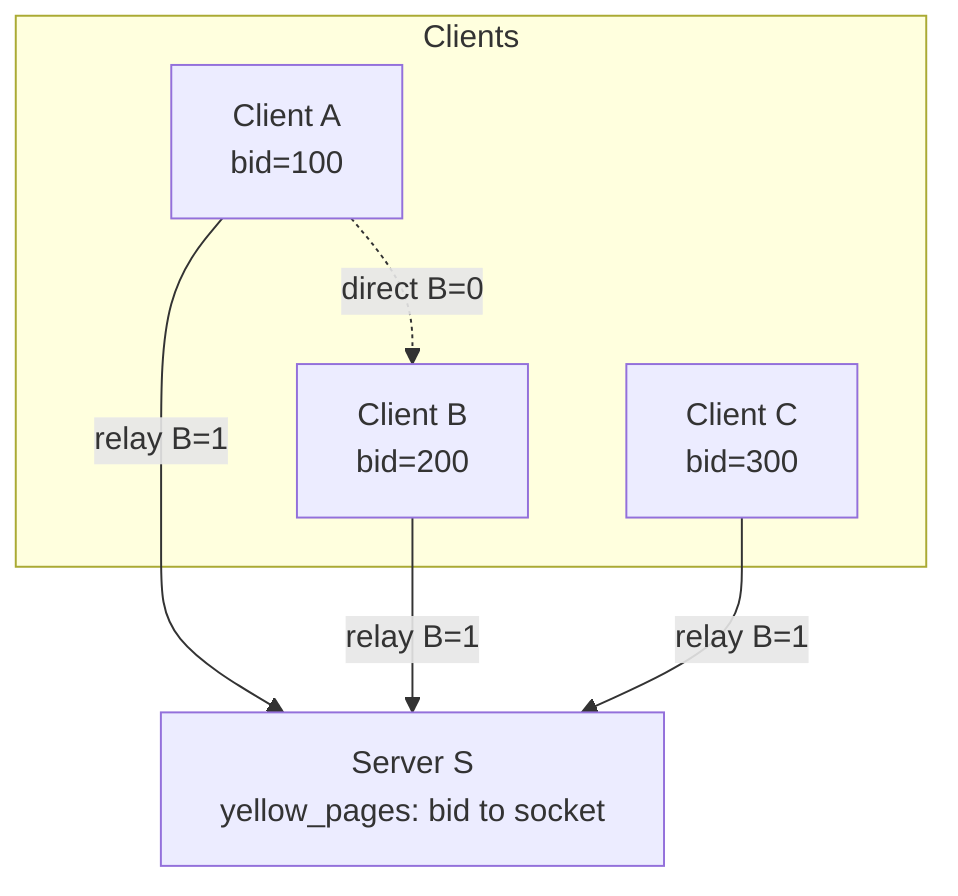
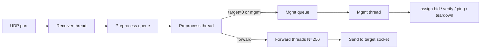
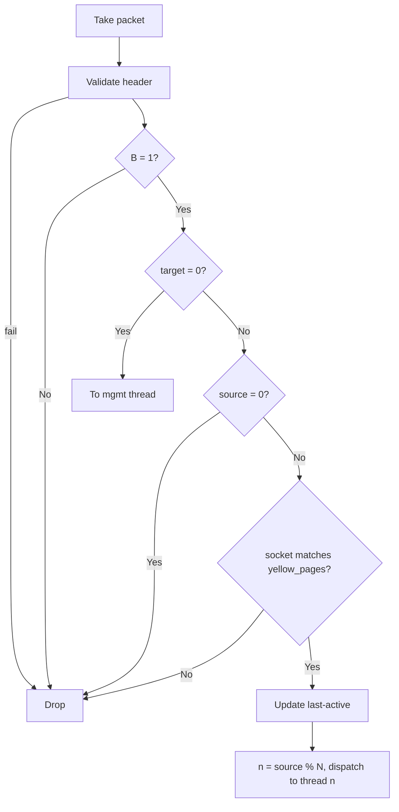
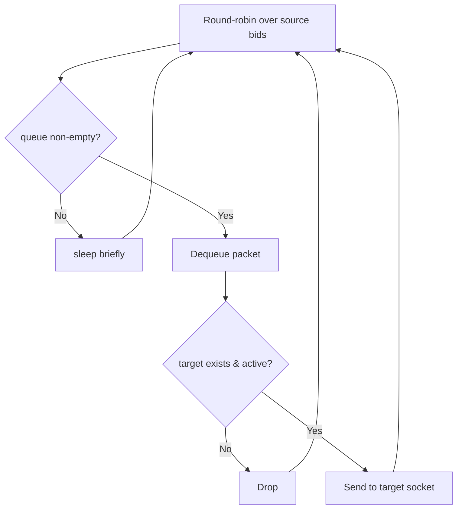

# Magpie Bridge Architecture Design

## Topology

N:1 C-S structure. Server S is an independent relay node, serving only clients registered on it.

## Server Thread Model

Receive and forward are separated:

### Receiver Thread

Binds a single UDP port; on receive, pushes packet + socket into the preprocess queue. No extra fd as users grow.

### Preprocess Thread

### Management Thread

Handles management packets with target=0:

| Type | Key | Action |
|------|-----|--------|
| SYN? | source=0 | allocate bid, bind socket, reply SYN! |
| ACK! | command=ACK! and source>0 | verify socket, dispatch to forward thread |
| PING | command=PING | reply PONG, update last-active |
| FIN? | command=FIN? | delete record, release bid |

### Forward Threads (N=256)

Sharded by `n = source_bid % N`; each forward thread holds send queues per source bid.

**Flow control**: per-thread rate limit; one flood cannot affect other threads.
