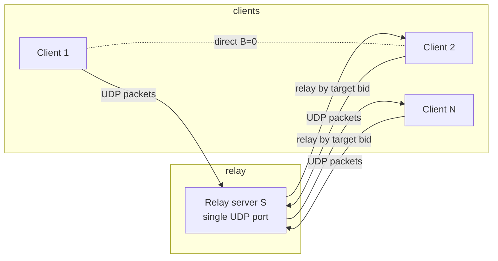
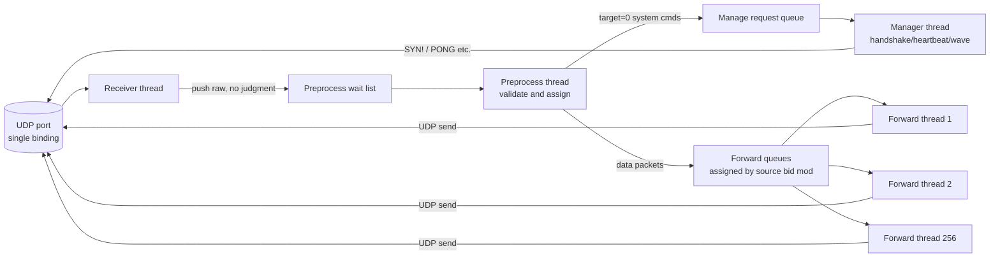
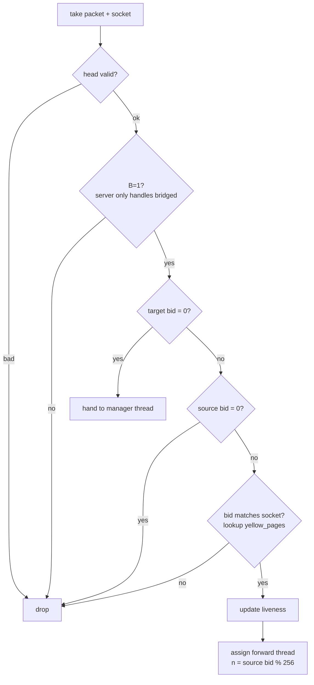
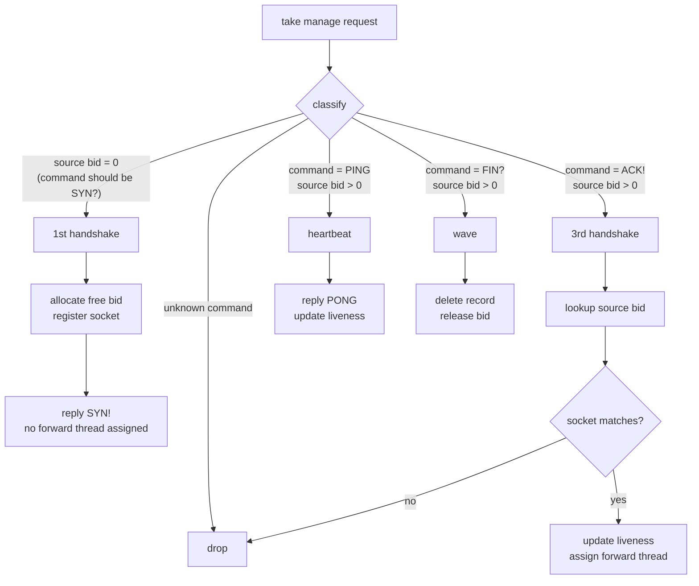
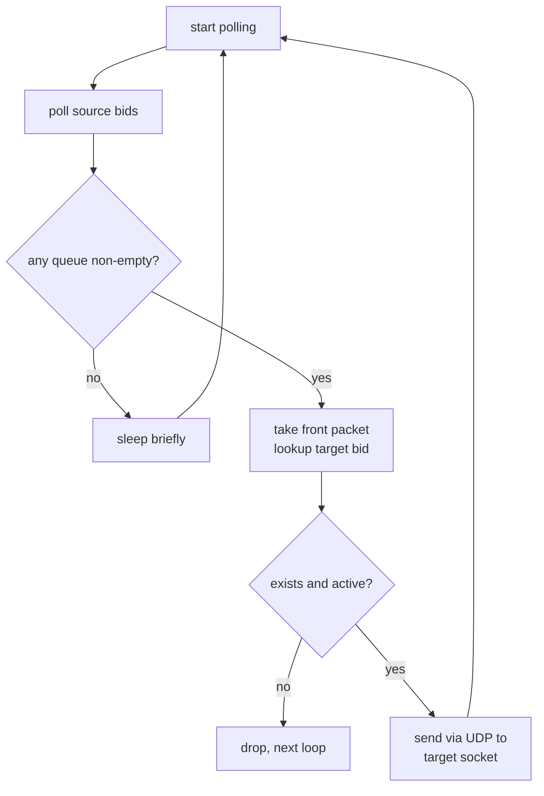

# Magpie Bridge Architecture Design

The network structure is **N:1 client-server**: server S is a discrete relay node that serves many clients efficiently, but only those registered on it. The server only provides minimal relaying and is not linked to other servers.

## 1. System Architecture

- The server keeps an in-memory **yellow_pages: bid → socket** mapping table;
- A client applies for a bid (doorplate) via handshake; other clients can then request relaying by bid.

## 2. Server Internals (Separated RX/TX)

Receiving and forwarding are handled by **separate threads**: the receiver only receives; N=256 forwarding threads only send.

- **Receiver thread**: binds one UDP port, pushes each packet with its socket info into the preprocess wait list without any judgment. One UDP port means fd usage does not grow with users;
- **Preprocess thread**: validates and assigns (see below);
- **Manager thread**: handles system commands such as handshake / heartbeat / wave;
- **Forward threads (N=256)**: poll and send data packets.

## 3. Preprocess Validation Chain

> source=0 implies target=0 (only true for the 1st handshake packet); source=0 with target≠0 is a bad packet and dropped.

## 4. Manager Thread

Takes packets from the manage queue and identifies the command type; unknown commands are dropped.

## 5. Forward Threads (N=256)

When assigning, the preprocess thread computes `n = (source bid) % N` and hands the packet to thread n; each thread keeps one wait queue per source bid.

- **Breadth-first**: polls queues of all source bids, so one user flooding cannot starve others;
- **Rate limiting**: a cap on tasks per time unit prevents traffic storms; since work is split across 256 threads, one thread hitting its cap does not affect others, containing storms to a small scope.
