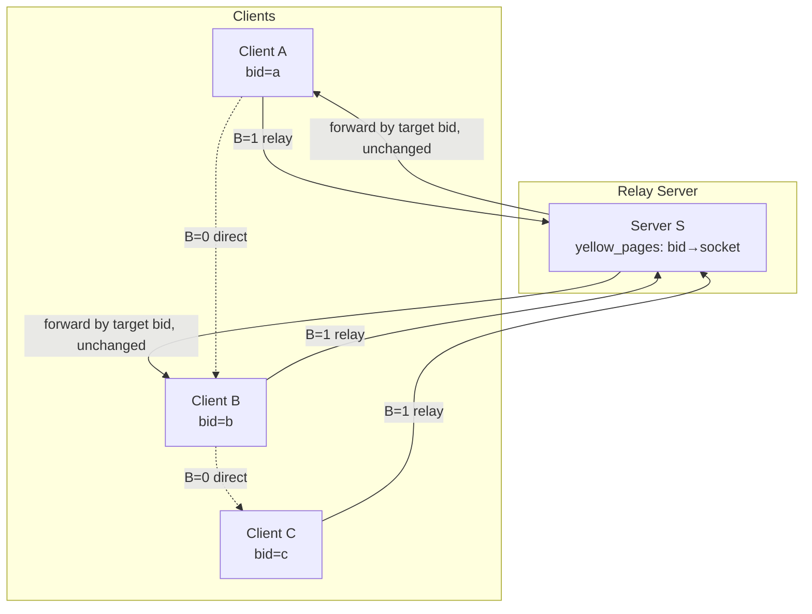
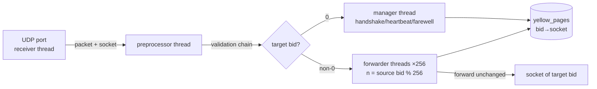
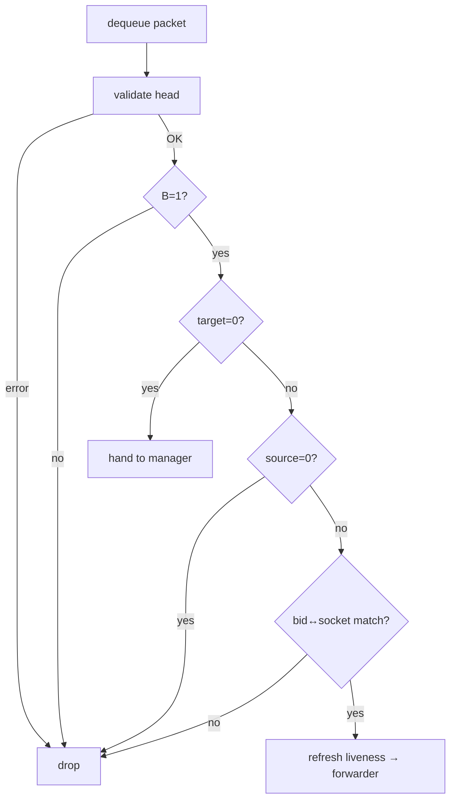

# Magpie Bridge Architecture Design

The network is an **N:1 C-S structure**: S is a discrete relay node serving only clients registered on it; servers are not associated with each other and offer nothing but simple relay.

## 1. System Architecture



Key points:

- Direct (B=0, no bid fields) is preferred when possible; otherwise relay via the server (B=1);
- The server only maps bid→socket via yellow_pages and forwards packets unchanged;
- Clients obtain a bid by handshake and broadcast it; others relay by that bid.

## 2. Server Internals



**Preprocessor validation chain** (drop on any failure):



| Thread | Responsibility |
|---|---|
| Receiver | Binds one UDP port; enqueues packets without judgment |
| Preprocessor | Validates head, B=1, target/source legality, bid↔socket match; refreshes liveness |
| Manager | Handles 1st/3rd handshake, PING, FIN?; unknown command dropped |
| Forwarder ×256 | Sharded by source bid % 256, breadth-first polling, forward unchanged |

> source=0 exists only in the 1st handshake packet (then target must be 0); source=0 with target≠0 is an error packet and is dropped.

## 3. Manager Thread Handling

```mermaid
flowchart LR
    Q[management request] --> T{recognize}
    T -- source=0<br/>"SYN?" --> H1[1st handshake<br/>assign bid, register socket, reply SYN!]
    T -- "ACK!"<br/>source>0 --> H3[3rd handshake<br/>validate socket, assign forwarder]
    T -- "PING"<br/>source>0 --> HB[heartbeat<br/>reply PONG, refresh liveness]
    T -- "FIN?"<br/>source>0 --> FW[farewell<br/>remove record, release bid]
    T -- other --> UN[unknown command dropped]
```

## 4. Flow Control

Forwarder threads throttle (a cap on tasks per time window). Tasks are sharded across 256 threads by `source bid % 256`, so one thread hitting its cap does not affect the others, confining any storm to a very small scope.
