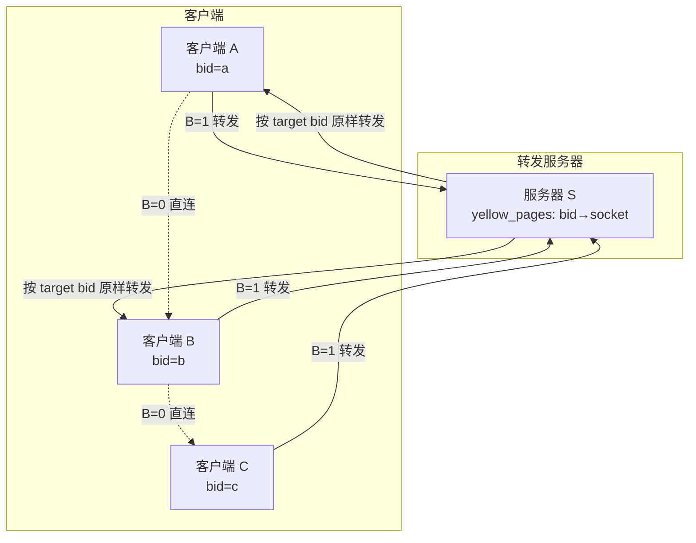
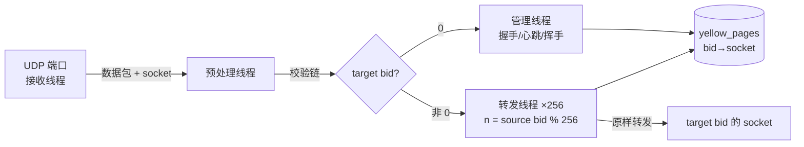
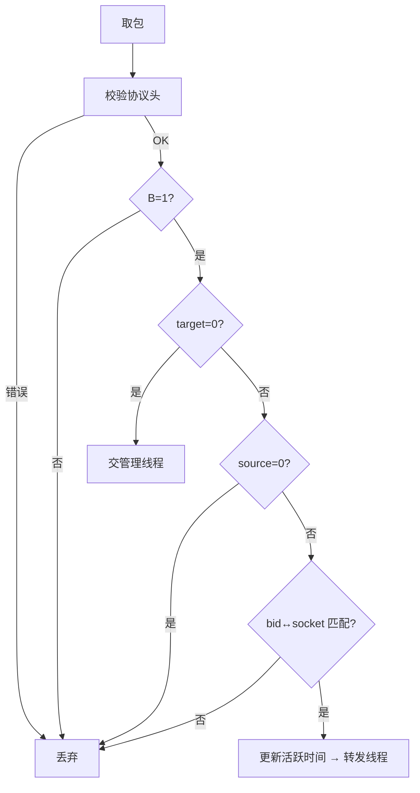
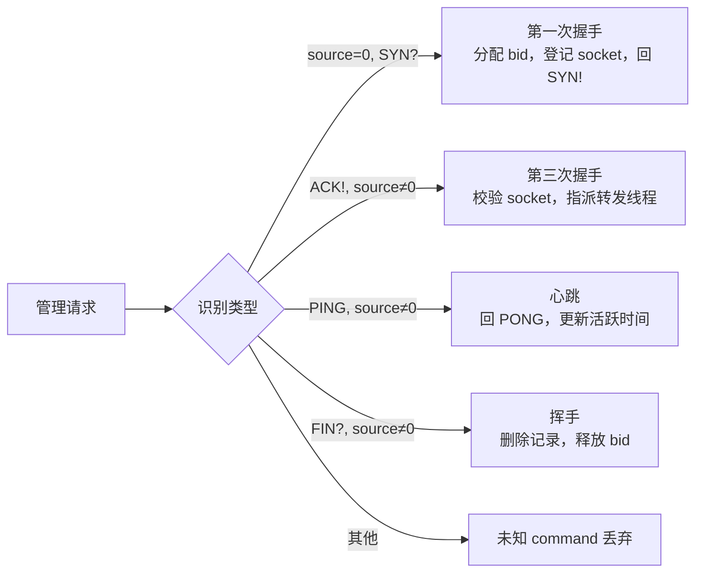

# Magpie Bridge 架构设计

网络结构为 **N:1 的 C-S 结构**：S 为离散型转发节点，只为已在本服务器注册的客户端服务；服务器互不关联，只做最简单的转发。

## 1. 系统架构

要点：

- 可直连时优先直连（B=0，无 bid 字段）；否则经服务器转发（B=1）；
- 服务器只按 yellow_pages 中 bid→socket 映射转发，不改动数据包；
- 客户端通过握手申请 bid 并广播，其他客户端凭 bid 请求转发。

## 2. 服务器内部架构

**预处理校验链**（任一失败即丢弃）：

| 线程 | 职责 |
|---|---|
| 接收线程 | 绑定单 UDP 端口，收包即入队，不做判断 |
| 预处理线程 | 校验协议头、B=1、target/source 合法性、bid↔socket 匹配，更新活跃时间 |
| 管理线程 | 处理第一次/第三次握手、PING、FIN?；未知 command 丢弃 |
| 转发线程 ×256 | 按 source bid % 256 分片，广度优先轮询，原样转发 |

> source=0 仅存在于第一次握手包（此时 target 必为 0）；若 source=0 而 target≠0 属错误包直接丢弃。

## 3. 管理线程处理

## 4. 流量控制

转发线程限流（设定规定时间内最多处理任务数上限）。任务按 `source bid % 256` 拆分给 256 条线程，单条线程达到上限不影响其他线程，将风暴控制在很小的范围内。
