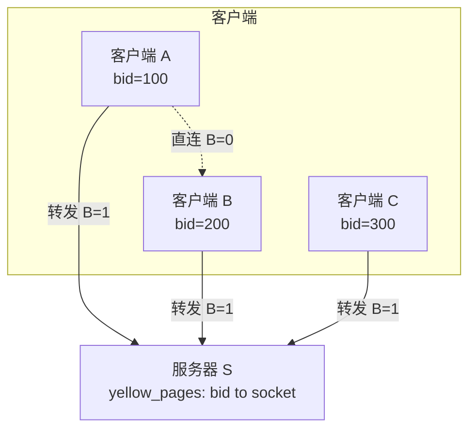
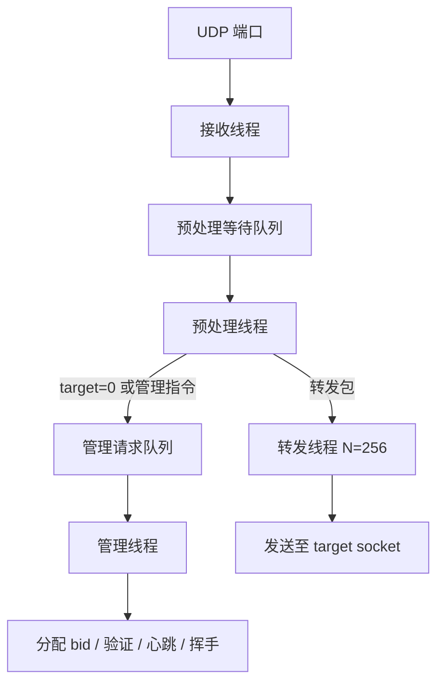
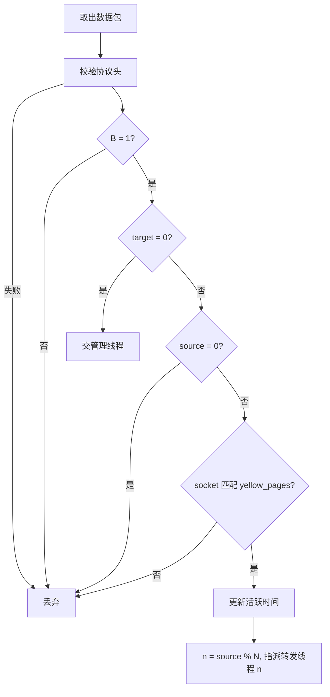
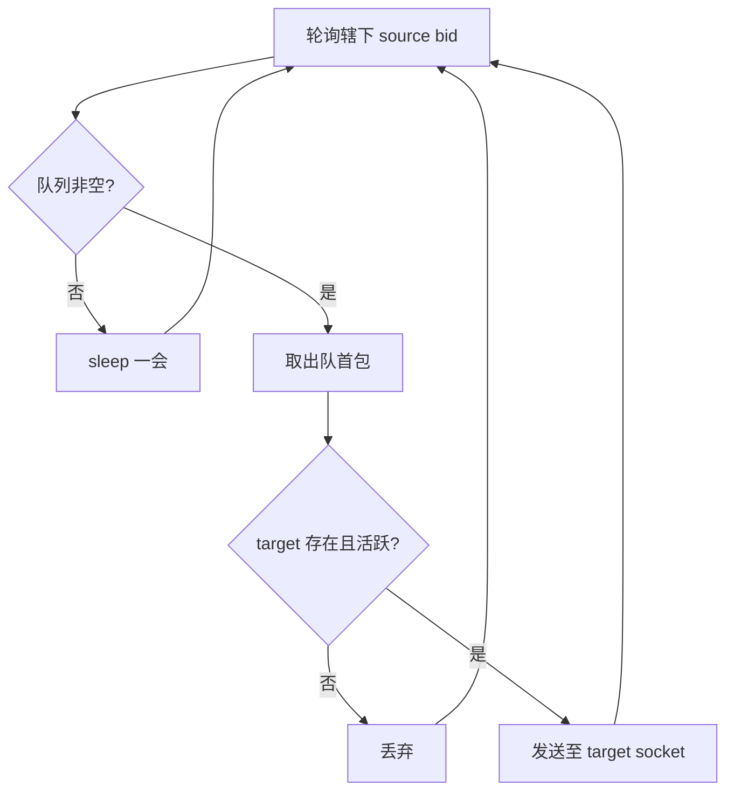

# Magpie Bridge 架构设计

## 网络拓扑

N:1 C-S 结构。服务器 S 为独立转发节点，仅服务于在本服务器注册的客户端。

## 服务器线程模型

收发分离：

### 接收线程

绑定单一 UDP 端口，收到包后连同 socket 直接塞入预处理队列。不随用户数增加 fd 占用。

### 预处理线程

### 管理线程

处理 target=0 的管理类包：

| 类型 | 判断依据 | 动作 |
|------|---------|------|
| SYN? | source=0 | 分配 bid，绑定 socket，回 SYN! |
| ACK! | command=ACK! 且 source>0 | 验证 socket，指派转发线程 |
| PING | command=PING | 回 PONG，更新活跃时间 |
| FIN? | command=FIN? | 删除记录，释放 bid |

### 转发线程（N=256）

按 `n = source_bid % N` 分片，每条转发线程维护多个 source bid 的发送队列。

**流量控制**：每线程限流，单用户打满不影响其他线程。
