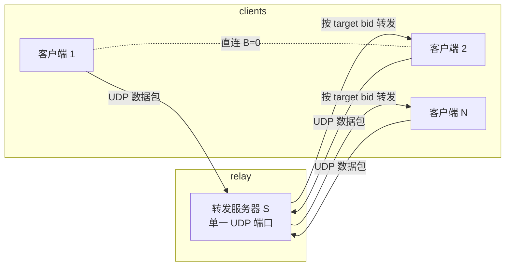
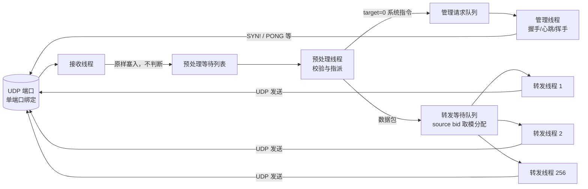
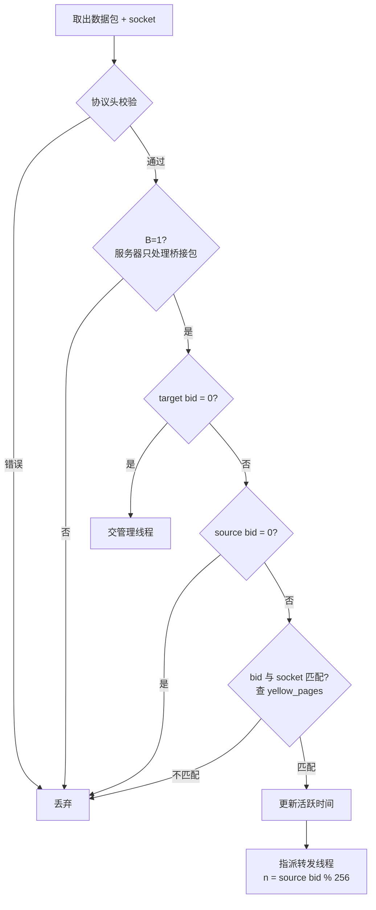
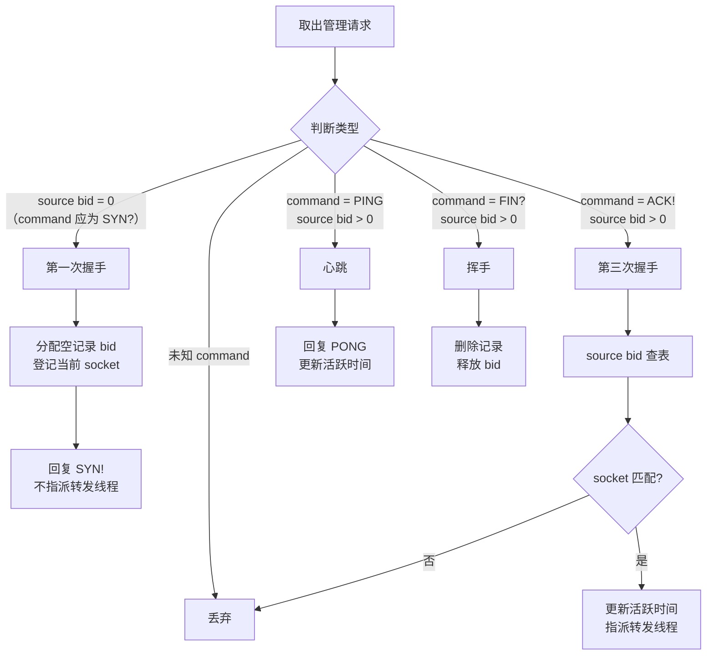
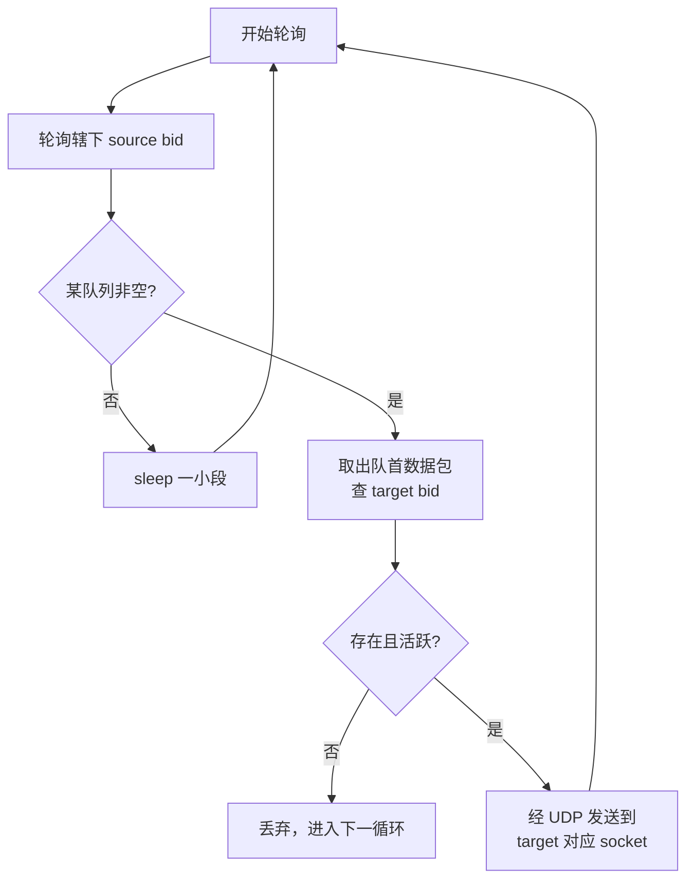

# Magpie Bridge 架构设计

网络结构为 **N:1 的 C-S 结构**：服务器 S 是离散型转发节点，可高效为众多客户端提供转发服务，但仅限于已在本服务器注册的客户端。服务器只做最简单转发，不与其他服务器关联。

## 1. 系统架构

- 服务器在内存维护一张 **yellow_pages：bid → socket** 映射表；
- 客户端经握手向服务器申请 bid（门牌号），此后其他客户端可凭 bid 请求转发。

## 2. 服务器内部架构（收发分离）

接收与转发由**独立线程**处理：接收线程只管收，转发线程（N=256 条）只管发。

- **接收线程**：绑定一个 UDP 端口，收到包不做任何判断，连同 socket 信息塞进预处理等待列表。UDP 单端口不随用户数增加 fd 占用；
- **预处理线程**：校验并指派（见下）；
- **管理线程**：处理握手 / 心跳 / 挥手等系统指令；
- **转发线程（N=256）**：轮询并发送数据包。

## 3. 预处理校验链

> source bid=0 时 target bid 必为 0（仅"第一次握手包"如此）；若 source=0 而 target≠0，属错误包直接丢弃。

## 4. 管理线程

从管理请求队列取包，识别指令类型；无法识别为下列任一类型（未知 command）直接丢弃。

## 5. 转发线程（N=256）

预处理线程指派任务时计算 `n = (source bid) % N`，交给第 n 条转发线程；线程内为每个 source bid 建一个等待转发队列。

- **广度优先**：轮询辖下所有 source bid 的队列，避免单个用户洪泛挤占其他用户；
- **流量控制**：设定单位时间处理上限，防止流量风暴；因任务拆分到 256 条线程，单线程达上限不影响其他线程，风暴被限制在小范围。
