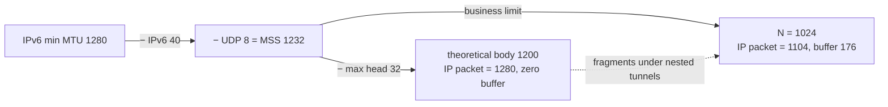

# Magpie Bridge Protocol Design

The protocol format consists of two parts: the **head** and the **body**. The receiver validates every field against the standard; a failing packet is judged an error packet and may be dropped directly.

## 1. Head

Head length ranges from 8 to 32 octets: the first 8 are fixed; the remaining 24 form a variable parameter area assembled by the flags.

### 1.1 Wire Format

> Maximum layout (B/C/D all set, E=4 → 32 octets); real fields are concatenated by flags. index/count width is decided by E (1/2/4 octets).

     0                   1                   2                   3
     0 1 2 3 4 5 6 7 8 9 0 1 2 3 4 5 6 7 8 9 0 1 2 3 4 5 6 7 8 9 0 1
    +-+-+-+-+-+-+-+-+-+-+-+-+-+-+-+-+-+-+-+-+-+-+-+-+-+-+-+-+-+-+-+-+
    |      'M'      |      'P'      |     '\0'      |     '\1'      |
    +-+-+-+-+-+-+-+-+-+-+-+-+-+-+-+-+-+-+-+-+-+-+-+-+-+-+-+-+-+-+-+-+
    |      type     |   head size   |           body size           |
    +-+-+-+-+-+-+-+-+-+-+-+-+-+-+-+-+-+-+-+-+-+-+-+-+-+-+-+-+-+-+-+-+
    |                        target bridge id                       |
    +-+-+-+-+-+-+-+-+-+-+-+-+-+-+-+-+-+-+-+-+-+-+-+-+-+-+-+-+-+-+-+-+
    |                        source bridge id                       |
    +-+-+-+-+-+-+-+-+-+-+-+-+-+-+-+-+-+-+-+-+-+-+-+-+-+-+-+-+-+-+-+-+
    |                       data serial number                      |
    +-+-+-+-+-+-+-+-+-+-+-+-+-+-+-+-+-+-+-+-+-+-+-+-+-+-+-+-+-+-+-+-+
    |           data index          |           data count          |
    +-+-+-+-+-+-+-+-+-+-+-+-+-+-+-+-+-+-+-+-+-+-+-+-+-+-+-+-+-+-+-+-+
    |                            command                            |
    +-+-+-+-+-+-+-+-+-+-+-+-+-+-+-+-+-+-+-+-+-+-+-+-+-+-+-+-+-+-+-+-+

### 1.2 Magic Code (4 octets)

> MC = ['M', 'P', '\0', '\1'], meaning _Message Protocol v1_ (MP = MagPie / Magpie Protocol / Message Protocol / Message Packet).

### 1.3 Measuring/Validation Area (4 octets)

The Type octet: high 4 bits are flags; low 4 bits (E) are the segment parameter width.

| Bit | Name | Mask | Desc |
|---|---|---|---|
| A | ACK | 0x80 | Acknowledgement flag |
| B | BID | 0x40 | Bridge flag (target/source, 4 octets each) |
| C | CMD | 0x20 | Whether a command follows (4 octets) |
| D | DSN | 0x10 | Whether a serial number follows (4 octets) |
| E | LEN | 0x0F | Segment parameter width (0/1/2/4) |

**Head size** (1 octet):

    N = 8 + 8*B + 4*D + 2*E + 4*C

Must satisfy 8 ≤ N ≤ 32 and equal the 2nd head octet; E is allowed to be 0/1/2/4 only — other values and non-derivable head sizes are error packets.

**Body size** (2 octets): head + body = total ≤ MSS (1232), otherwise an error packet.

### 1.4 Variable Parameter Area

| # | Variable | Length |
|:---:|------|-----:|
| 1 | target bid | 4 bytes |
| 2 | source bid | 4 bytes |
| 3 | serial number (dsn) | 4 bytes |
| 4 | index | 1/2/4 bytes |
| 5 | count | 1/2/4 bytes |
| 6 | command | 4 bytes |

- **B=1**: carries target/source; after validation the server relays unchanged if target is non-zero. B=0 means a client-direct packet; sending it to the server is an error.
- **D=1**: carries dsn, used only by normal data packets and their COPY replies; system commands (handshake/heartbeat/farewell) use D=0, carry no dsn, and the sender needs no wait-for-reply queue.
- **index/count**: present when E>0; 0 ≤ index < count and count ≥ 2; E=0 means no parameters (equivalent to index=0, count=1).
- **C=1**: the last 4 head octets are a command (values in the workflow document).

### 1.5 Splitting & Deduplication

dsn increments per original (pre-split) packet; sub-packets of one split share the dsn, so the receiver deduplicates by dsn+index (mid is a 64-bit unsigned integer):

```mermaid
flowchart TD
    P[packet received] --> E{E > 0?<br/>segmented}
    E -- no --> M1[mid = dsn]
    E -- yes --> M2[mid = dsn << 8*E | index]
    M1 --> T[dedup table]
    M2 --> T
    T -- exists --> DR[drop]
    T -- new --> ACC[accept]
```

> Deduplication applies to data packets (replies included) only; system commands (D=0) are excluded.

## 2. Body

- **Business limit**: N = 1024 octets (1 KiB)
- **Transport hard limit**: MSS = 1232 octets (UDP payload)

### 2.1 MSS & Body Limit Decision



```
    MSS = 1232  # 1280 - 40 - 8（IPv4 UDP limit 1472, IPv6 MTU1500 limit 1452）
```

- Total IP datagram = head(32) + body(1024) + UDP(8) + IPv6(40) = **1104 octets**;
- Buffer = 1280 − 1104 = **176 octets**: one medium tunnel layer (WireGuard 60–80B, OpenVPN UDP 60–70B) or two lightweight layers (1280−60−60=1160>1104) still avoids re-fragmentation;
- With 1200 (IP packet exactly 1280), nested tunnels fragment easily (e.g. 1280−50 IPSec−24 GRE leaves only 1158B usable).

### 2.2 Segment Size Classes

| E | Param width | Class | Upper bound |
|---|---|---|---|
| 0 | — | mini message | ≤ 1024 B |
| 1 | 1 byte | small file | ≤ 255 KiB (255×1024 = 261,120 B) |
| 2 | 2 bytes | normal file | ≤ 64 MiB (65535×1024 ≈ 67,107,840 B) |
| 4 | 4 bytes | large file | ≤ 4096 GiB ((2³²−1)×1024 ≈ 4,398,046,511,104 B) |

> Binary units (KiB/MiB/GiB); exact value = count upper bound × 1024; 64 MiB exactly = 64 MiB − 1 KiB, 4096 GiB exactly = 4096 GiB − 1 KiB.
