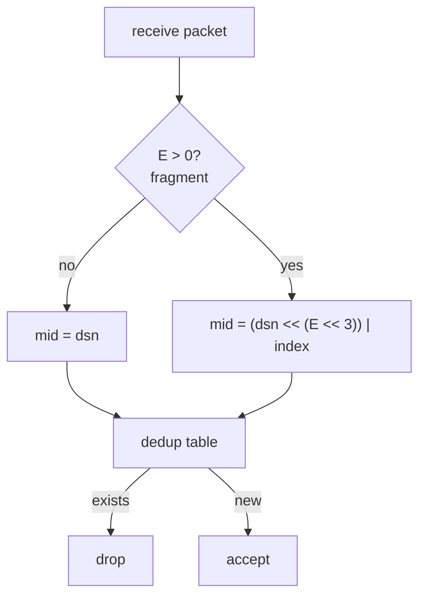
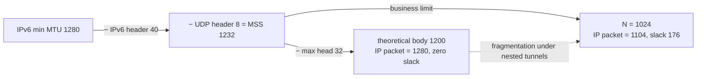

# Magpie Bridge Protocol Design

The protocol consists of a **head** and a **body**. The receiver validates the packet field by field; any violation marks it as a bad packet and it is dropped.

## Abbreviations

| Term | Meaning |
|---|---|
| MP | MagPie / Magpie Protocol / Message Protocol / Message Packet |
| BID | Bridge ID (registration number / doorplate) |
| DSN | Data Serial Number (data / file sequence number) |
| MSS | Maximum Segment Size |
| MTU | Maximum Transmission Unit |

## 1. Head

The head is 8–32 bytes: the first 8 bytes are fixed, the remaining 24 bytes are a variable parameter area assembled by flags.

### 1.1 Wire Format

> Layout below shows the maximum size (B/C/D all set, E=4 → 32 bytes); actual fields are concatenated by flags, offsets shift accordingly. index/count width is decided by E (1/2/4 bytes).

     0                   1                   2                   3
     0 1 2 3 4 5 6 7 8 9 0 1 2 3 4 5 6 7 8 9 0 1 2 3 4 5 6 7 8 9 0 1
    +-+-+-+-+-+-+-+-+-+-+-+-+-+-+-+-+-+-+-+-+-+-+-+-+-+-+-+-+-+-+-+-+
    |      'M'      |      'P'      |     '\0'      |     '\1'      |
    +-+-+-+-+-+-+-+-+-+-+-+-+-+-+-+-+-+-+-+-+-+-+-+-+-+-+-+-+-+-+-+-+
    |      type     |   head size   |           body size           |
    +-+-+-+-+-+-+-+-+-+-+-+-+-+-+-+-+-+-+-+-+-+-+-+-+-+-+-+-+-+-+-+-+
    |                        target bridge id                       |
    +-+-+-+-+-+-+-+-+-+-+-+-+-+-+-+-+-+-+-+-+-+-+-+-+-+-+-+-+-+-+-+-+
    |                        source bridge id                       |
    +-+-+-+-+-+-+-+-+-+-+-+-+-+-+-+-+-+-+-+-+-+-+-+-+-+-+-+-+-+-+-+-+
    |                       data serial number                      |
    +-+-+-+-+-+-+-+-+-+-+-+-+-+-+-+-+-+-+-+-+-+-+-+-+-+-+-+-+-+-+-+-+
    |           data index          |           data count          |
    +-+-+-+-+-+-+-+-+-+-+-+-+-+-+-+-+-+-+-+-+-+-+-+-+-+-+-+-+-+-+-+-+
    |                            command                            |
    +-+-+-+-+-+-+-+-+-+-+-+-+-+-+-+-+-+-+-+-+-+-+-+-+-+-+-+-+-+-+-+-+

### 1.2 Magic Code (fixed 4 bytes)

`['M', 'P', '\0', '\1']` = _Message Protocol v1_.

### 1.3 Type (byte 5)

High 4 bits are flags; low 4 bits (E) is the width of the fragmentation parameters (index, count):

      0   1   2   3   4   5   6   7
    +---+---+---+---+---+---+---+---+
    | A | B | C | D |               |
    | C | I | M | S |      LEN      |
    | K | D | D | N |               |
    +---+---+---+---+---+---+---+---+

| Bit | Name | Mask | Description |
|---|---|---|
| A | ACK | 0x80 | Acknowledgement flag |
| B | BID | 0x40 | Bridged packet flag (target/source, 4 bytes each) |
| C | CMD | 0x20 | Whether command is present (4 bytes) |
| D | DSN | 0x10 | Whether serial number (4 bytes) and fragmentation params are present |
| E | LEN | 0x0F | Width of (index, count); only 0/1/2/4 allowed |

### 1.4 Measure & Validate Area (fixed 4 bytes)

Right after Magic Code: Type (1) + head size (1) + body size (2).

**Head size** (must equal byte 2, otherwise bad packet):

    N = 8 + 8*B + 4*D + 2*E + 4*C

**Body size**: head + body = total length ≤ MSS (1232), otherwise bad packet.

### 1.5 Fragmentation Specs

E decides the width of the fragmentation parameters, mapping to 4 packet classes (binary units; exact = count max × 1024):

| E | Param width | count range | Class | Limit |
|---|---|---|---|---|
| 0 | — | 1 (no params) | mini message | 1 KiB = 1024 B |
| 1 | 1 byte | 2 ~ 255 | small file | 255 KiB = 261,120 B |
| 2 | 2 bytes | 256 ~ 65,535 | normal file | 64 MiB − 1 KiB ≈ 67,107,840 B |
| 4 | 4 bytes | 65,536 ~ 2³²−1 | huge file | 4096 GiB − 1 KiB ≈ 4,398,046,511,104 B |

> Constraints: E > 0 implies D=1, count ≥ 2, 0 ≤ index < count; count=1 must use E=0; E = 3 or 5~15 is a bad packet.

### 1.6 Variable Parameter Area

| # | Variable | Length |
|:---:|---|:---:|
| 1 | target bid | 4 bytes |
| 2 | source bid | 4 bytes |
| 3 | serial number (dsn) | 4 bytes |
| 4 | index | 1/2/4 bytes |
| 5 | count | 1/2/4 bytes |
| 6 | command | 4 bytes |

**B (bridged)**: B=1 carries target/source; after validation the server forwards packets with target≠0 unchanged. B=0 is direct client-to-client only; sending it to the server is a bad packet.

**D (serial)**: D=1 carries dsn, used only by data packets and their COPY acknowledgements (dsn pairing for confirmation); system commands are always D=0. **Bit D is the direct criterion for "wait for acknowledgement after sending"**.

**C (command)**: C=1 appends a 4-byte command at the end; its value must be one of the defined values below, otherwise bad packet.

### 1.7 dsn and Deduplication

dsn increments per **original (pre-split) data packet** (fragments share the same dsn); the receiver deduplicates by dsn+index, mid is a 64-bit unsigned integer:

    if E == 0:
        mid = dsn
    else:
        mid = (dsn << (E << 3)) | index

> dsn increments uniformly in one direction (connection/pipeline); deduplication applies to data packets (including acknowledgements) only, system commands (D=0) are excluded.

## 2. Command

When C=1, the last 4 bytes of the head are the command; defined values:

| Value | Flags | Description |
|---|---|---|
| SYN? | A=0, C=1, D=0, E=0 | 1st handshake |
| SYN! | A=1, C=1, D=0, E=0 | 2nd handshake (reply) |
| ACK! | A=1, C=1, D=0, E=0 | 3rd handshake (connected) |
| DATA | A=0, D=1 | normal data packet (C may be 0 or 1) |
| COPY | A=1, C=1, D=1 | data acknowledgement |
| PING | A=0, C=1, D=0, E=0 | heartbeat request |
| PONG | A=1, C=1, D=0, E=0 | heartbeat reply |
| FIN? | A=0, C=1, D=0, E=0 | 1st wave |
| FIN! | A=1, C=1, D=0, E=0 | 2nd wave (reply) |
| NOOP | - | reserved |
| USER | - | user-defined |

> System commands (SYN?/SYN!/ACK!/PING/PONG/FIN?/FIN!) are all D=0 without dsn; replies pair by socket, so the sender keeps no waiting queue; only data packets and COPY use D=1.

## 3. Body

- **Hard transport limit**: MSS = 1232 bytes (UDP payload)
- **Business limit**: N = 1024 bytes (1 KiB)

### 3.1 MSS and Body Limit Decision

- Total IP datagram = head (32) + body (1024) + UDP (8) + IPv6 (40) = **1104 bytes**;
- Slack = 1280 − 1104 = **176 bytes**: a single medium tunnel (WireGuard 60–80B, OpenVPN UDP 60–70B) or two light tunnels (1280−60−60=1160 > 1104) still avoids re-fragmentation;
- With 1200 (IP packet exactly 1280), nested tunnels fragment easily (e.g. 1280−50 IPSec−24 GRE leaves only 1158B payload).

### 3.2 MSS vs Body Limit

- MSS = 1232 is the hard transport validation limit (head + body ≤ MSS for any packet), independent of the business limit;
- N = 1024 is the more conservative business limit (head + body ≤ 1056 < 1232); the two coexist without conflict.
