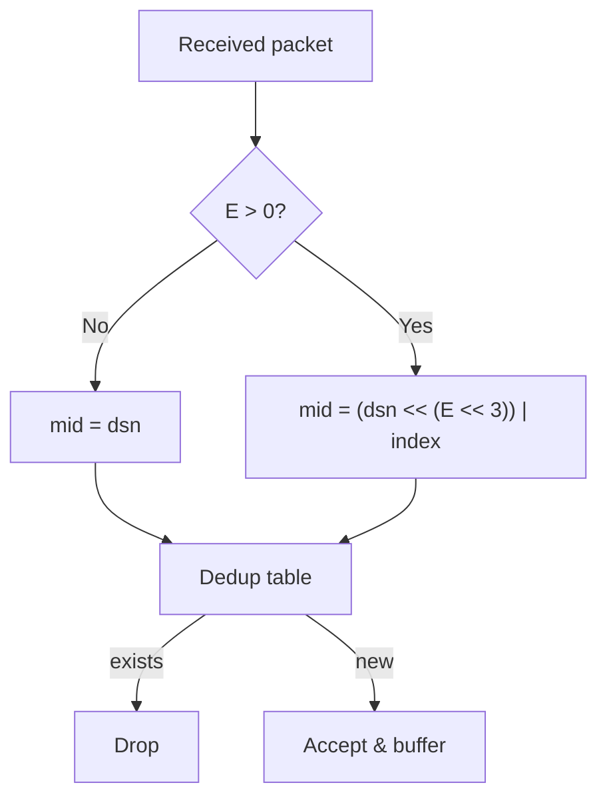

# Magpie Bridge Protocol Design

## Overview

The protocol consists of a **Header** and a **Body**. The receiver validates every field; any violation causes the packet to be dropped.

## Wire Format

The first 8 bytes are fixed; the following 24 bytes are variable (determined by Type flags). head_size ∈ [8, 32].

```
     0                   1                   2                   3
     0 1 2 3 4 5 6 7 8 9 0 1 2 3 4 5 6 7 8 9 0 1 2 3 4 5 6 7 8 9 0 1
    +-+-+-+-+-+-+-+-+-+-+-+-+-+-+-+-+-+-+-+-+-+-+-+-+-+-+-+-+-+-+-+-+
    |      'M'      |      'P'      |     '\0'      |     '\1'      |
    +-+-+-+-+-+-+-+-+-+-+-+-+-+-+-+-+-+-+-+-+-+-+-+-+-+-+-+-+-+-+-+-+
    |      type     |   head size   |           body size           |
    +-+-+-+-+-+-+-+-+-+-+-+-+-+-+-+-+-+-+-+-+-+-+-+-+-+-+-+-+-+-+-+-+
    |                        target bridge id                       |
    +-+-+-+-+-+-+-+-+-+-+-+-+-+-+-+-+-+-+-+-+-+-+-+-+-+-+-+-+-+-+-+-+
    |                        source bridge id                       |
    +-+-+-+-+-+-+-+-+-+-+-+-+-+-+-+-+-+-+-+-+-+-+-+-+-+-+-+-+-+-+-+-+
    |                       data serial number                      |
    +-+-+-+-+-+-+-+-+-+-+-+-+-+-+-+-+-+-+-+-+-+-+-+-+-+-+-+-+-+-+-+-+
    |           data index          |           data count          |
    +-+-+-+-+-+-+-+-+-+-+-+-+-+-+-+-+-+-+-+-+-+-+-+-+-+-+-+-+-+-+-+-+
    |                            command                            |
    +-+-+-+-+-+-+-+-+-+-+-+-+-+-+-+-+-+-+-+-+-+-+-+-+-+-+-+-+-+-+-+-+
```

> Layout above shows the maximum (B/C/D/E all set). Fields are concatenated by flags; offsets shift accordingly. index/count width is decided by E (1/2/3/4 bytes).

## Magic Code

`MC = ['M', 'P', '\0', '\1']`, i.e. Message Protocol v1.

## Type Byte

High nibble: flags. Low nibble: E (fragment param width).

```
      0   1   2   3   4   5   6   7
    +---+---+---+---+---+---+---+---+
    | A | B | C | D |               |
    | C | I | M | S |    EXT LEN    |
    | K | D | D | N |               |
    +---+---+---+---+---+---+---+---+
```

| Bit | Name | Mask | Meaning |
|-----|------|------|---------|
| 7 | A | 0x80 | ACK flag |
| 6 | B | 0x40 | Bridged packet (carries target/source bid) |
| 5 | C | 0x20 | Has command (4 bytes) |
| 4 | D | 0x10 | Has dsn (4 bytes) and fragment params |
| 3–0 | E | 0x0F | Fragment param (index, count) width |

### head_size Formula

```
N = 8 + 8*B + 4*D + 2*E + 4*C      (8 <= N <= 32)
```

Validation: E must be 0~4; 5~15 is a bad packet. For byte alignment, packing only uses E=0/2/4.

## E Spec Table

| E | Width | count range | Class | Limit |
|---|-------|-------------|-------|-------|
| 0 | — | 1 (no params) | mini message | 1 KiB = 1024 B ✅ |
| 1 | 1 B | 2 ≤ count < 256 | small file | 256 KiB = 262,144 B _reserved_ |
| 2 | 2 B | 256 ≤ count < 65,536 | normal file | 64 MiB = 67,108,864 B ✅ |
| 3 | 3 B | 65,536 ≤ count < 16,777,216 | large file | 16 GiB = 17,179,869,184 B _deprecated_ |
| 4 | 4 B | 16,777,216 ≤ count < 4,294,967,296 | huge file | 4 TiB = 4,398,046,511,104 B ✅ |

> Packing only emits E=0/2/4; E=1 is reserved, E=3 is deprecated. Validation still accepts 0~4.

## Variable Params

| Order | Field | Length | Condition |
|:---:|-------|--------|-----------|
| 1 | target bid | 4 B | B=1 |
| 2 | source bid | 4 B | B=1 |
| 3 | dsn | 4 B | D=1 |
| 4 | index | E bytes | E>0 |
| 5 | count | E bytes | E>0 |
| 6 | command | 4 B | C=1 |

## dsn and Fragment Dedup

dsn increments per **original pre-fragment message** (fragments share the same dsn). The receiver reassembles/dedupes by (dsn, index); mid is a 64-bit unsigned integer:



## Command

| Command | Flags | Description |
|---------|-------|-------------|
| SYN? | A=0, C=1, D=0, E=0 | 1st handshake |
| SYN! | A=1, C=1, D=0, E=0 | 2nd handshake (ACK) |
| ACK! | A=1, C=1, D=0, E=0 | 3rd handshake |
| DATA | A=0, D=1 (C optional) | Data packet |
| COPY | A=1, C=1, D=1 | Data ACK |
| PING | A=0, C=1, D=0, E=0 | Heartbeat request |
| PONG | A=1, C=1, D=0, E=0 | Heartbeat reply |
| FIN? | A=0, C=1, D=0, E=0 | 1st teardown |
| FIN! | A=1, C=1, D=0, E=0 | 2nd teardown (ACK) |

> System commands (SYN?/SYN!/ACK!/PING/PONG/FIN?/FIN!) are always D=0, carry no dsn, and require no pending-ACK queue. The D bit directly tells the sender whether to wait for an ACK.

## MSS and Body Limit

```
MSS = 1232              # 1280 (IPv6 min MTU) - 40 (IPv6 hdr) - 8 (UDP hdr)
Business body cap = 1024  # head(32) + body(1024) = 1056 < 1232
Total IP datagram = 1056 + 8 + 40 = 1104 B    # 176 B safety margin
```

## Constraints

- E>0 implies D=1; count=1 implies E=0; 0 ≤ index < count
- head_size + body_size ≤ MSS(1232)
- When C=1, command must be a defined value, otherwise bad packet
