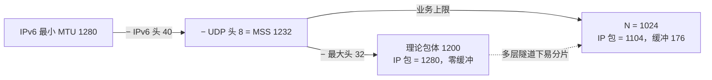

# Magpie Bridge 协议设计

通讯协议格式由**协议头 (head)** 和**协议体 (body)** 两部分组成。接收方按协议标准逐项校验，不符合规范即判定为错误包，可直接丢弃。

## 1. 协议头 (Head)

协议头大小 8–32 字节：前 8 字节固定，后 24 字节为按标志位拼接的可变参数区。

### 1.1 线格式

> 最大布局示意（B/C/D 全置位、E=4 时共 32 字节）；实际字段按标志位依次拼接。index/count 宽度由 E 决定（1/2/4 字节）。

     0                   1                   2                   3
     0 1 2 3 4 5 6 7 8 9 0 1 2 3 4 5 6 7 8 9 0 1 2 3 4 5 6 7 8 9 0 1
    +-+-+-+-+-+-+-+-+-+-+-+-+-+-+-+-+-+-+-+-+-+-+-+-+-+-+-+-+-+-+-+-+
    |      'M'      |      'P'      |     '\0'      |     '\1'      |
    +-+-+-+-+-+-+-+-+-+-+-+-+-+-+-+-+-+-+-+-+-+-+-+-+-+-+-+-+-+-+-+-+
    |      type     |   head size   |           body size           |
    +-+-+-+-+-+-+-+-+-+-+-+-+-+-+-+-+-+-+-+-+-+-+-+-+-+-+-+-+-+-+-+-+
    |                        target bridge id                       |
    +-+-+-+-+-+-+-+-+-+-+-+-+-+-+-+-+-+-+-+-+-+-+-+-+-+-+-+-+-+-+-+-+
    |                        source bridge id                       |
    +-+-+-+-+-+-+-+-+-+-+-+-+-+-+-+-+-+-+-+-+-+-+-+-+-+-+-+-+-+-+-+-+
    |                       data serial number                      |
    +-+-+-+-+-+-+-+-+-+-+-+-+-+-+-+-+-+-+-+-+-+-+-+-+-+-+-+-+-+-+-+-+
    |           data index          |           data count          |
    +-+-+-+-+-+-+-+-+-+-+-+-+-+-+-+-+-+-+-+-+-+-+-+-+-+-+-+-+-+-+-+-+
    |                            command                            |
    +-+-+-+-+-+-+-+-+-+-+-+-+-+-+-+-+-+-+-+-+-+-+-+-+-+-+-+-+-+-+-+-+

### 1.2 Magic Code（固定 4 字节）

> MC = ['M', 'P', '\0', '\1']，表示 _Message Protocol v1_（MP = MagPie / Magpie Protocol / Message Protocol / Message Packet）。

### 1.3 测量校验区（固定 4 字节）

Type 字节：高 4 位为标志位，低 4 位（E）为分包参数宽度。

| 位 | 名称 | 掩码 | 说明 |
|---|------|------|------|
| A | ACK | 0x80 | 应答标志位 |
| B | BID | 0x40 | 桥接包标志位（target/source 各 4 字节） |
| C | CMD | 0x20 | 是否包含 command（4 字节） |
| D | DSN | 0x10 | 是否包含序列号（4 字节） |
| E | LEN | 0x0F | 分包参数长度（0/1/2/4） |

**协议头长度**（1 字节）：

    N = 8 + 8*B + 4*D + 2*E + 4*C

须满足 8 ≤ N ≤ 32 且与头部第 2 字节一致；E 仅允许 0/1/2/4，其余值及算不出的 head_size 均判错误包。

**协议体长度**（2 字节）：头长度 + 体长度 = 总长度 ≤ MSS（1232），否则错误包。

### 1.4 可变参数区

| 顺序 | 变量 | 长度 |
|:---:|------|-----:|
| 1 | target bid | 4 bytes |
| 2 | source bid | 4 bytes |
| 3 | serial number (dsn) | 4 bytes |
| 4 | index | 1/2/4 bytes |
| 5 | count | 1/2/4 bytes |
| 6 | command | 4 bytes |

- **B=1**：携带 target/source；服务器校验后若 target 非 0 则原样转发。B=0 为客户端直连包，发给服务器判错误。
- **D=1**：携带 dsn，仅用于普通数据包及其应答 COPY；系统指令（握手/心跳/挥手）D=0，不携带 dsn，发送方无需维护等待应答队列。
- **index/count**：E>0 时出现，0 ≤ index < count 且 count ≥ 2；E=0 无参数（等价 index=0, count=1）。
- **C=1**：末尾 4 字节为 command（取值见工作流文档）。

### 1.5 分包与去重

dsn 针对拆分前的原始数据包自增；拆分包各子包 dsn 相同，接收方按 dsn+index 拼接去重（mid 为 64 位无符号整数）：

```mermaid
flowchart TD
    P[收到数据包] --> E{E > 0?<br/>拆分包}
    E -- 否 --> M1[mid = dsn]
    E -- 是 --> M2[mid = dsn << 8*E &#124; index]
    M1 --> T[查重表]
    M2 --> T
    T -- 已存在 --> DR[丢弃]
    T -- 新消息 --> ACC[接收]
```



> 去重仅针对数据包（含应答包）；系统指令（D=0）不参与。

## 2. 协议体 (Body)

- **业务上限**：N = 1024 字节（1 KiB）
- **传输硬上限**：MSS = 1232 字节（UDP 载荷）

### 2.1 MSS 与包体上限决策



```
    MSS = 1232  # 1280 - 40 - 8（IPv4 UDP 上限 1472，IPv6 MTU1500 上限 1452）
```

- 总 IP 数据报 = 头(32) + 体(1024) + UDP(8) + IPv6(40) = **1104 字节**；
- 缓冲 = 1280 − 1104 = **176 字节**：叠加一层中等隧道（WireGuard 60–80B、OpenVPN UDP 60–70B）或两层轻量隧道（1280−60−60=1160>1104）均不会被再次分包；
- 若取 1200（IP 包恰为 1280），多层隧道下极易分片（如 1280−50 IPSec−24 GRE 后可用载荷仅 1158B）。

### 2.2 分包规格

E 档位对应 4 种规格的消息/文件包：

| E | 参数宽度 | 规格 | 上限 |
|---|---|---|---|
| 0 | — | mini 消息包 | ≤ 1024 B |
| 1 | 1 字节 | 小文件 | ≤ 255 KiB（255×1024 = 261,120 B） |
| 2 | 2 字节 | 普通文件 | ≤ 64 MiB（65535×1024 ≈ 67,107,840 B） |
| 4 | 4 字节 | 超大文件 | ≤ 4096 GiB（(2³²−1)×1024 ≈ 4,398,046,511,104 B） |

> 二进制单位（KiB/MiB/GiB），精确值 = count 上限 × 1024；64 MiB 精确 = 64 MiB − 1 KiB，4096 GiB 精确 = 4096 GiB − 1 KiB。
