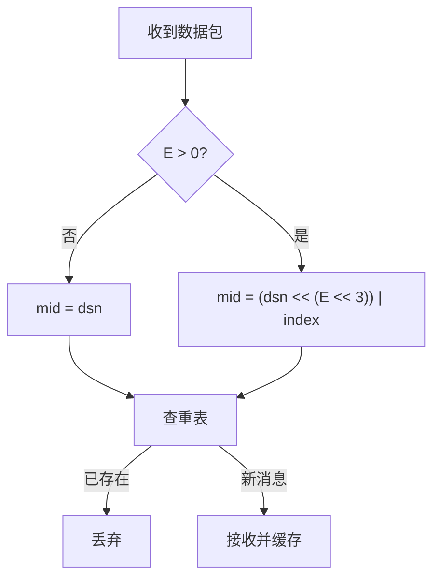

# Magpie Bridge 协议设计

## 概述

协议由 **协议头 (Head)** + **协议体 (Body)** 组成。接收方逐项校验，不符合即丢弃。

## 协议格式

头 8 字节固定，后续 24 字节可变（由 Type 标志位决定），head_size ∈ [8, 32]。

```
     0                   1                   2                   3
     0 1 2 3 4 5 6 7 8 9 0 1 2 3 4 5 6 7 8 9 0 1 2 3 4 5 6 7 8 9 0 1
    +-+-+-+-+-+-+-+-+-+-+-+-+-+-+-+-+-+-+-+-+-+-+-+-+-+-+-+-+-+-+-+-+
    |      'M'      |      'P'      |     '\0'      |     '\1'      |
    +-+-+-+-+-+-+-+-+-+-+-+-+-+-+-+-+-+-+-+-+-+-+-+-+-+-+-+-+-+-+-+-+
    |      type     |   head size   |           body size           |
    +-+-+-+-+-+-+-+-+-+-+-+-+-+-+-+-+-+-+-+-+-+-+-+-+-+-+-+-+-+-+-+-+
    |                        target bridge id                       |
    +-+-+-+-+-+-+-+-+-+-+-+-+-+-+-+-+-+-+-+-+-+-+-+-+-+-+-+-+-+-+-+-+
    |                        source bridge id                       |
    +-+-+-+-+-+-+-+-+-+-+-+-+-+-+-+-+-+-+-+-+-+-+-+-+-+-+-+-+-+-+-+-+
    |                       data serial number                      |
    +-+-+-+-+-+-+-+-+-+-+-+-+-+-+-+-+-+-+-+-+-+-+-+-+-+-+-+-+-+-+-+-+
    |           data index          |           data count          |
    +-+-+-+-+-+-+-+-+-+-+-+-+-+-+-+-+-+-+-+-+-+-+-+-+-+-+-+-+-+-+-+-+
    |                            command                            |
    +-+-+-+-+-+-+-+-+-+-+-+-+-+-+-+-+-+-+-+-+-+-+-+-+-+-+-+-+-+-+-+-+
```

> 上图为最大布局（B/C/D/E 全置位）。实际字段按标志位依次拼接，偏移随之前移。index/count 宽度由 E 决定（1/2/3/4 字节）。

## Magic Code

`MC = ['M', 'P', '\0', '\1']`，表示 Message Protocol v1。

## Type 字节

高 4 位标志位 + 低 4 位 E（分包参数长度）：

```
      0   1   2   3   4   5   6   7
    +---+---+---+---+---+---+---+---+
    | A | B | C | D |               |
    | C | I | M | S |    EXT LEN    |
    | K | D | D | N |               |
    +---+---+---+---+---+---+---+---+
```

| Bit | Name | Mask | 含义 |
|-----|------|------|------|
| 7 | A | 0x80 | 应答标志 |
| 6 | B | 0x40 | 桥接包（含 target/source bid） |
| 5 | C | 0x20 | 含 command（4 字节） |
| 4 | D | 0x10 | 含 dsn（4 字节）及分包参数 |
| 3–0 | E | 0x0F | 分包参数 (index, count) 宽度 |

### head_size 公式

```
N = 8 + 8*B + 4*D + 2*E + 4*C      (8 ≤ N ≤ 32)
```

校验规则：E 允许 0~4；5~15 判错误包。打包时为字节对齐，E 仅取 0/2/4。

## E 规格表

| E | 宽度 | count 范围 | 规格 | 上限 |
|---|------|-----------|------|------|
| 0 | — | 1（无参数） | mini 消息包 | 1 KiB = 1024 B ✅ |
| 1 | 1 B | 2 ≤ count < 256 | 小文件 | 256 KiB = 262,144 B _保留_ |
| 2 | 2 B | 256 ≤ count < 65,536 | 普通文件 | 64 MiB = 67,108,864 B ✅ |
| 3 | 3 B | 65,536 ≤ count < 16,777,216 | 大文件 | 16 GiB = 17,179,869,184 B _弃用_ |
| 4 | 4 B | 16,777,216 ≤ count < 4,294,967,296 | 超大文件 | 4 TiB = 4,398,046,511,104 B ✅ |

> 打包实际只用 E=0/2/4；E=1 保留、E=3 弃用。校验仍允许 0~4。

## 可变参数区

| 顺序 | 字段 | 长度 | 条件 |
|:---:|------|------|------|
| 1 | target bid | 4 B | B=1 |
| 2 | source bid | 4 B | B=1 |
| 3 | dsn | 4 B | D=1 |
| 4 | index | E 字节 | E>0 |
| 5 | count | E 字节 | E>0 |
| 6 | command | 4 B | C=1 |

## dsn 与分包去重

dsn 针对**拆分前的原始数据包**自增（拆分包 dsn 相同）。接收方按 (dsn, index) 拼接去重，mid 为 64 位无符号整数：



## Command

| Command | Flags | 说明 |
|---------|-------|------|
| SYN? | A=0, C=1, D=0, E=0 | 第 1 次握手 |
| SYN! | A=1, C=1, D=0, E=0 | 第 2 次握手（应答） |
| ACK! | A=1, C=1, D=0, E=0 | 第 3 次握手 |
| DATA | A=0, D=1（C 可选） | 普通数据包 |
| COPY | A=1, C=1, D=1 | 数据应答 |
| PING | A=0, C=1, D=0, E=0 | 发起心跳 |
| PONG | A=1, C=1, D=0, E=0 | 心跳应答 |
| FIN? | A=0, C=1, D=0, E=0 | 第 1 次挥手 |
| FIN! | A=1, C=1, D=0, E=0 | 第 2 次挥手（应答） |

> 系统指令（SYN?/SYN!/ACK!/PING/PONG/FIN?/FIN!）一律 D=0，不携带 dsn，发送方无需维护等待应答队列。D 位直接作为"是否需要等待应答"的判据。

## MSS 与包体上限

```
MSS = 1232             # 1280 (IPv6 min MTU) - 40 (IPv6 hdr) - 8 (UDP hdr)
业务包体上限 = 1024      # head(32) + body(1024) = 1056 < 1232
总 IP 数据报 = 1056 + 8 + 40 = 1104 B    # 预留 176 B 安全缓冲
```

## 约束汇总

- E>0 必 D=1；count=1 必 E=0；0 ≤ index < count
- head_size + body_size ≤ MSS(1232)
- C=1 时 command 必须是已定义值，否则错误包
