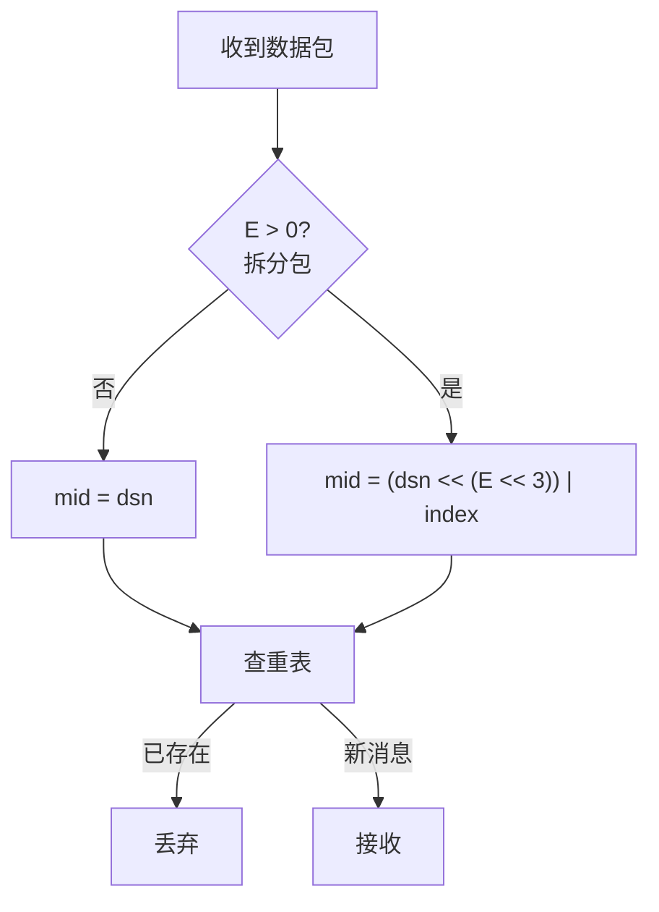
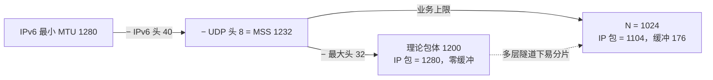

# Magpie Bridge 协议设计

通讯协议由**协议头 (head)** 与**协议体 (body)** 组成。接收方按标准逐项校验，不符合规范即判为错误包，直接丢弃。

## 缩略词

| 词 | 含义 |
|---|---|
| MP | MagPie / Magpie Protocol / Message Protocol / Message Packet |
| BID | Bridge ID（注册号 / 门牌号） |
| DSN | Data Serial Number（数据 / 文件序列号） |
| MSS | Maximum Segment Size |
| MTU | Maximum Transmission Unit |

## 1. 协议头 (Head)

协议头大小 8–32 字节：前 8 字节固定，后 24 字节为按标志位拼接的可变参数区。

### 1.1 线格式

> 下图为最大布局示意（B/C/D 全置位、E=4 时共 32 字节）；实际字段按标志位依次拼接，偏移随之前移。index/count 宽度由 E 决定（1/2/4 字节）。

     0                   1                   2                   3
     0 1 2 3 4 5 6 7 8 9 0 1 2 3 4 5 6 7 8 9 0 1 2 3 4 5 6 7 8 9 0 1
    +-+-+-+-+-+-+-+-+-+-+-+-+-+-+-+-+-+-+-+-+-+-+-+-+-+-+-+-+-+-+-+-+
    |      'M'      |      'P'      |     '\0'      |     '\1'      |
    +-+-+-+-+-+-+-+-+-+-+-+-+-+-+-+-+-+-+-+-+-+-+-+-+-+-+-+-+-+-+-+-+
    |      type     |   head size   |           body size           |
    +-+-+-+-+-+-+-+-+-+-+-+-+-+-+-+-+-+-+-+-+-+-+-+-+-+-+-+-+-+-+-+-+
    |                        target bridge id                       |
    +-+-+-+-+-+-+-+-+-+-+-+-+-+-+-+-+-+-+-+-+-+-+-+-+-+-+-+-+-+-+-+-+
    |                        source bridge id                       |
    +-+-+-+-+-+-+-+-+-+-+-+-+-+-+-+-+-+-+-+-+-+-+-+-+-+-+-+-+-+-+-+-+
    |                       data serial number                      |
    +-+-+-+-+-+-+-+-+-+-+-+-+-+-+-+-+-+-+-+-+-+-+-+-+-+-+-+-+-+-+-+-+
    |           data index          |           data count          |
    +-+-+-+-+-+-+-+-+-+-+-+-+-+-+-+-+-+-+-+-+-+-+-+-+-+-+-+-+-+-+-+-+
    |                            command                            |
    +-+-+-+-+-+-+-+-+-+-+-+-+-+-+-+-+-+-+-+-+-+-+-+-+-+-+-+-+-+-+-+-+

### 1.2 Magic Code（固定 4 字节）

`['M', 'P', '\0', '\1']` = _Message Protocol v1_。

### 1.3 Type（第 5 字节）

高 4 位为标志位，低 4 位（E）为分包参数 (index, count) 的长度：

      0   1   2   3   4   5   6   7
    +---+---+---+---+---+---+---+---+
    | A | B | C | D |               |
    | C | I | M | S |      LEN      |
    | K | D | D | N |               |
    +---+---+---+---+---+---+---+---+

| 位 | 名称 | 掩码 | 说明 |
|---|---|---|
| A | ACK | 0x80 | 应答标志位 |
| B | BID | 0x40 | 桥接包标志位（target/source 各 4 字节） |
| C | CMD | 0x20 | 是否包含 command（4 字节） |
| D | DSN | 0x10 | 是否包含序列号（4 字节）及可能的分包参数 |
| E | LEN | 0x0F | 分包参数 (index, count) 宽度，仅允许 0/1/2/4 |

### 1.4 测量校验区（固定 4 字节）

紧接 Magic Code：Type (1) + 头长度 (1) + 体长度 (2)。

**协议头长度**（与第 2 字节一致，否则错误包）：

    N = 8 + 8*B + 4*D + 2*E + 4*C

**协议体长度**：头 + 体 = 总长度 ≤ MSS (1232)，否则错误包。

### 1.5 分包规格

E 决定分包参数宽度，对应 4 种规格（二进制单位，精确值 = count 上限 × 1024）：

| E | 参数宽度 | count 范围 | 规格 | 上限 |
|---|---|---|---|---|
| 0 | — | 1（无参数） | mini 消息包 | 1 KiB = 1024 B |
| 1 | 1 字节 | 2 ~ 255 | 小文件 | 255 KiB = 261,120 B |
| 2 | 2 字节 | 256 ~ 65,535 | 普通文件 | 64 MiB − 1 KiB ≈ 67,107,840 B |
| 4 | 4 字节 | 65,536 ~ 2³²−1 | 超大文件 | 4096 GiB − 1 KiB ≈ 4,398,046,511,104 B |

> 约束：E > 0 时必 D=1、count ≥ 2、0 ≤ index < count；count=1 必须 E=0；E 为 3 或 5~15 判错误包。

### 1.6 可变参数区

| 顺序 | 变量 | 长度 |
|:---:|---|:---:|
| 1 | target bid | 4 bytes |
| 2 | source bid | 4 bytes |
| 3 | serial number (dsn) | 4 bytes |
| 4 | index | 1/2/4 bytes |
| 5 | count | 1/2/4 bytes |
| 6 | command | 4 bytes |

**B（桥接）**：B=1 携带 target/source；服务器校验后 target≠0 则原样转发。B=0 仅限客户端直连，发给服务器判错误包。

**D（序列号）**：D=1 携带 dsn，仅用于普通数据包及其应答 COPY（需 dsn 配对确认）；系统指令一律 D=0。**D 位可直接作为"发送后是否需等待应答"的判据**。

**C（指令）**：C=1 时末尾 4 字节为 command，取值必须为已定义值之一（见下），否则错误包。

### 1.7 dsn 与分包去重

dsn 针对**拆分前的原始数据包**自增（拆分包 dsn 相同），接收方按 dsn+index 拼接去重，mid 为 64 位无符号整数：

    if E == 0:
        mid = dsn
    else:
        mid = (dsn << (E << 3)) | index

> dsn 在同一方向（连接/管道）上统一自增；去重仅针对数据包（含应答包），系统指令（D=0）不参与。

## 2. Command

C=1 时末尾 4 字节为 command，已定义值如下：

| 值 | Flags | 说明 |
|---|---|---|
| SYN? | A=0, C=1, D=0, E=0 | 第 1 次握手 |
| SYN! | A=1, C=1, D=0, E=0 | 第 2 次握手（应答） |
| ACK! | A=1, C=1, D=0, E=0 | 第 3 次握手（成功连接） |
| DATA | A=0, D=1 | 普通数据包（C 可 0 可 1） |
| COPY | A=1, C=1, D=1 | 确认收到（数据应答包） |
| PING | A=0, C=1, D=0, E=0 | 发起心跳 |
| PONG | A=1, C=1, D=0, E=0 | 心跳应答 |
| FIN? | A=0, C=1, D=0, E=0 | 第 1 次挥手 |
| FIN! | A=1, C=1, D=0, E=0 | 第 2 次挥手（应答） |
| NOOP | - | 保留 |
| USER | - | 用户自定义 |

> 系统指令（SYN?/SYN!/ACK!/PING/PONG/FIN?/FIN!）均 D=0、不携带 dsn，应答配对依靠 socket，发送方无需维护等待应答队列；仅数据包与 COPY 使用 D=1。

## 3. 协议体 (Body)

- **传输硬上限**：MSS = 1232 字节（UDP 载荷）
- **业务上限**：N = 1024 字节（1 KiB）

### 3.1 MSS 与包体上限决策

- 总 IP 数据报 = 头 (32) + 体 (1024) + UDP (8) + IPv6 (40) = **1104 字节**；
- 缓冲 = 1280 − 1104 = **176 字节**：单层中等隧道（WireGuard 60–80B、OpenVPN UDP 60–70B）或两层轻量隧道（1280−60−60=1160 > 1104）均不会被再次分包；
- 若取 1200（IP 包恰为 1280），多层隧道下极易分片（如 1280−50 IPSec−24 GRE 后可用载荷仅 1158B）。

### 3.2 MSS 与包体上限的关系

- MSS = 1232 为传输层硬性校验上限（任意包头 + 体 ≤ MSS），不随业务上限改变；
- N = 1024 为更保守的业务上限（头 + 体 ≤ 1056 < 1232），二者并存不冲突。
