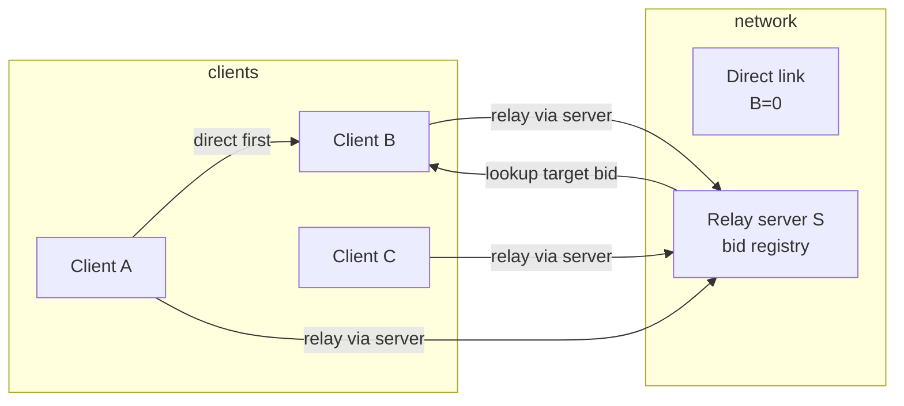
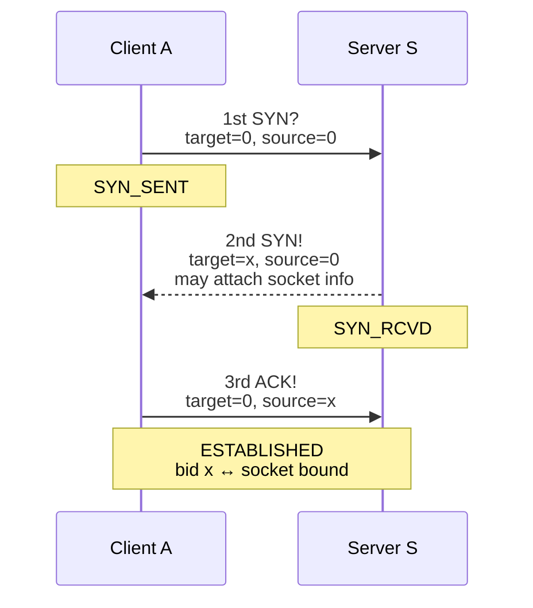
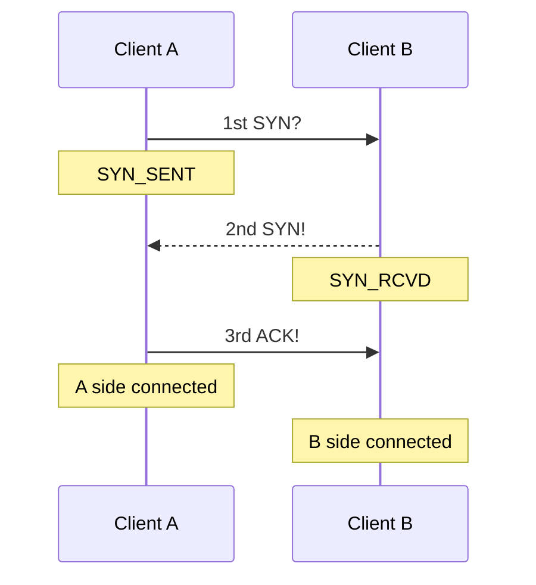
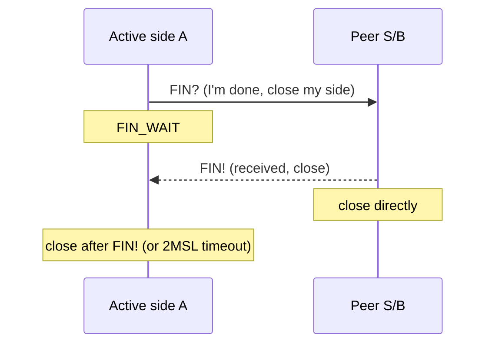
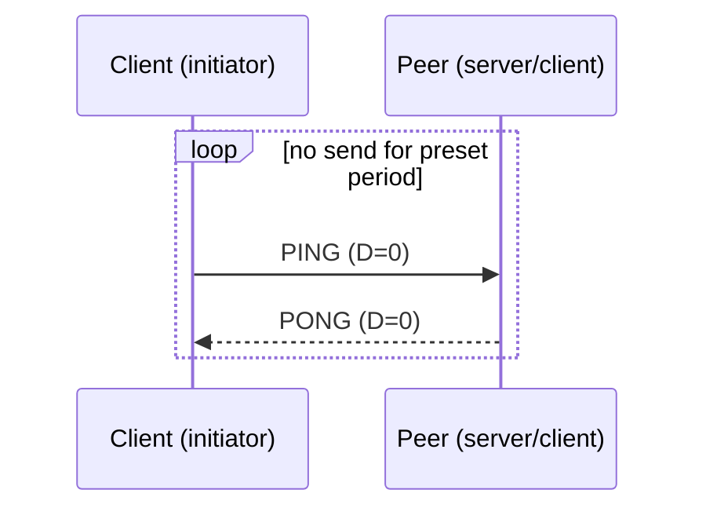
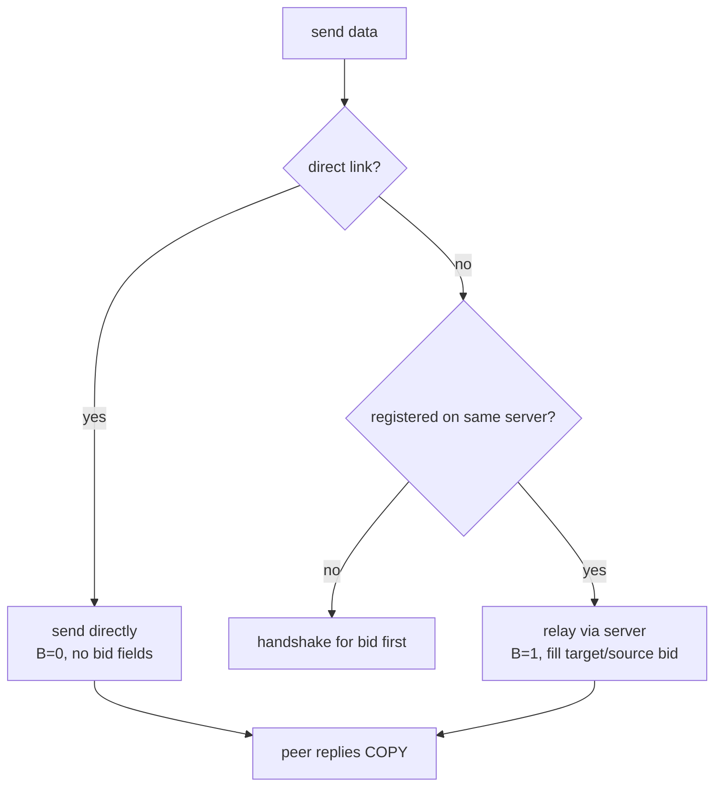
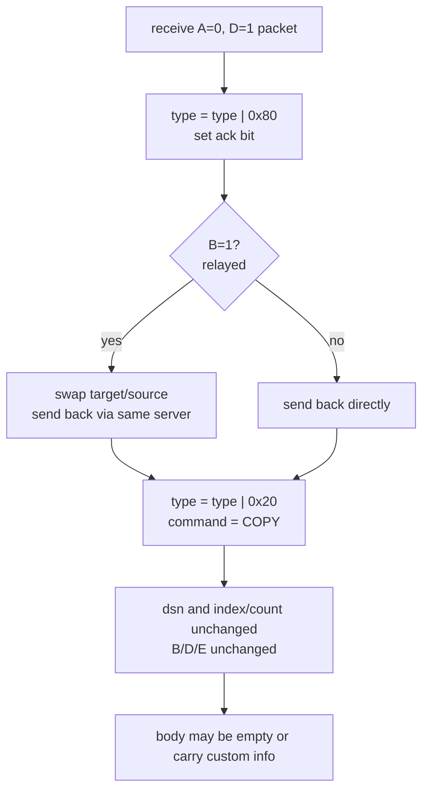

# Magpie Bridge Workflow Design

There are two roles: **client** and **relay server**. Two clients prefer a direct connection; otherwise data goes through server S. Relay servers are independent of each other; each client chooses a server by connectivity.

## 1. Network Topology

## 2. Handshake (Building the Bridge)

A client first applies for a bid from the server; other clients can then request relay by bid. Direct client-to-client links need no bid, but still need a handshake.

| Step | Flags | Command | DSN |
|---|---|---|---|
| 1st | A=0, C=1, D=0, E=0 | SYN? | - |
| 2nd | A=1, C=1, D=0, E=0 | SYN! | - |
| 3rd | A=1, C=1, D=0, E=0 | ACK! | - |

> System commands carry no dsn (D=0); replies pair by socket: reply to the socket the request came from. In the server scenario, source bid is only for identity validation (binding bid ↔ socket), not for reply addressing. The sender keeps no waiting queue.

### 2.1 Client ↔ Server (B=1)

> x is a random integer assigned by the server per socket. The server may attach the client socket info in SYN! (e.g. body `{"udp":"12.34.57.78:12345"}`, `body_size = len(body)`).

### 2.2 Client ↔ Client (B=0)

> A C-C handshake is two independent one-way "directed pipes": A marks its connection established after sending ACK; B marks its own after receiving that ACK.

### 2.3 bid Semantics

- The server is a "bridge"; bid is an integer (doorplate) assigned on first connection;
- After obtaining a bid, broadcast it out-of-band; the sender fills the peer number in target bid, and the server looks up the socket in its registry and relays;
- **target bid = 0**: addressed to the server itself (usually handshake/wave);
- **source bid = 0**: only possible for packets issued by the server. source=0 with target≠0 is illegal and dropped;
- Only when both target and source are non-zero does the server treat the packet as relaying: it validates both bids (source must match the socket, otherwise drop), then forwards **unchanged** to the target socket;
- When B relays through the server, B must fill its own source bid, otherwise A cannot identify the sender or reply with an automatic acknowledgement.

## 3. Wave (Closing the Connection)

Connections have a timeout for liveness, but can also be closed actively by waving.

| Step | Flags | Command | DSN |
|---|---|---|---|
| 1st | A=0, C=1, D=0, E=0 | FIN? | - |
| 2nd | A=1, C=1, D=0, E=0 | FIN! | - |

> Unlike TCP's 4-way wave, this closes directly. In the C-C case there are two directed pipes: the side that passively closes a pipe upon FIN then actively initiates the closing flow of the opposite pipe, approximating TCP's 4-way wave overall.

## 4. Heartbeat (Keep-alive)

A client periodically checks its own send time; if no packet (including acknowledgements) has been sent for a preset period, it actively sends a heartbeat to keep the connection alive.

> Heartbeat to a server uses B=1 (target=0, source=own bid); direct links use B=0. The server never initiates heartbeats; C-S liveness is maintained by the client, and each directed pipe in C-C is maintained by its own initiator.

## 5. Sending Mechanism

| Path | Flags | Command | DSN | index, count |
|---|---|---|---|---|
| Relay via server | A=0, B=1, C=0/1, D=1 | DATA optional | incremented | actual fragments |
| Direct send | A=0, B=0, C=0/1, D=1 | DATA optional | incremented | actual fragments |

- The server does **not** acknowledge relaying; the sender confirms delivery via the receiver's automatic COPY;
- The server checks that target bid exists and is active (uplink within period T), validates that source bid matches the socket, then updates the liveness time and relays unchanged.

## 6. Acknowledgement

On receiving a data packet (A=0, D=1, command DATA or none), the receiver must reply with a data acknowledgement COPY (A=1, D=1, echoing the source dsn and index/count). System commands (D=0) do not get COPY; they get their own replies (SYN!/PONG/FIN!).

| Path | Flags | Command | DSN | index, count |
|---|---|---|---|---|
| Relay via server | A=1, B=1, C=1, D=1 | COPY | source value | source fragments |
| Direct send | A=1, B=0, C=1, D=1 | COPY | source value | source fragments |

> Rules: set A=1 (`type = type | 0x80`); if B=1 swap target/source; set C=1 with command COPY; keep dsn/index/count; keep B/D/E; body may be empty.
