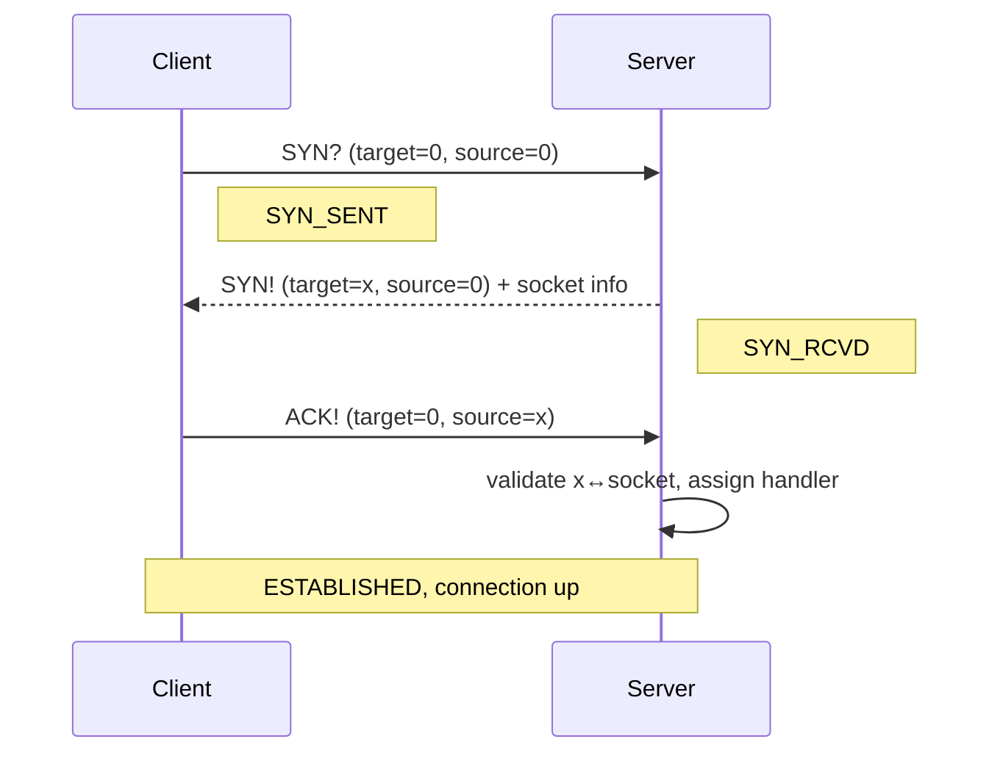
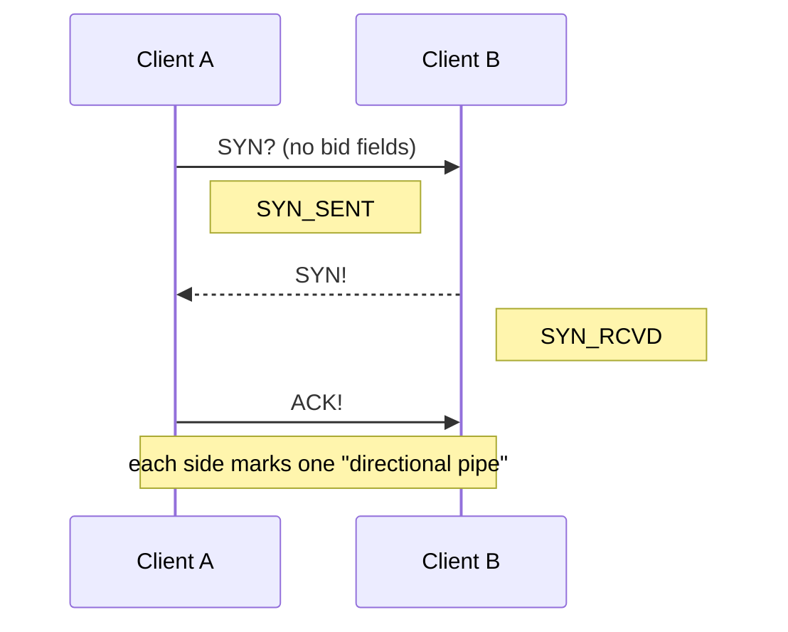
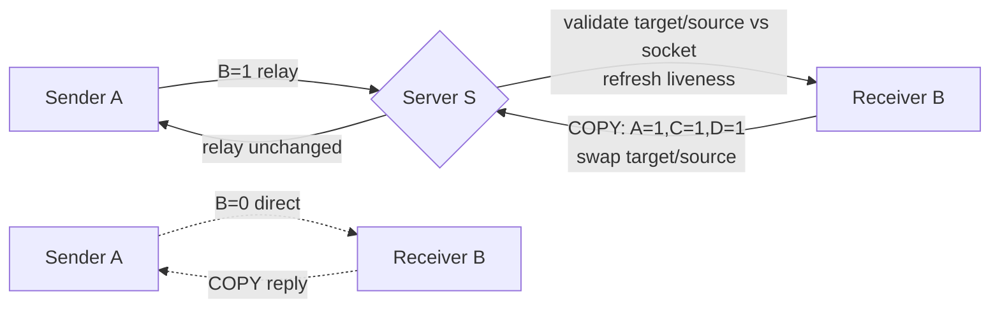
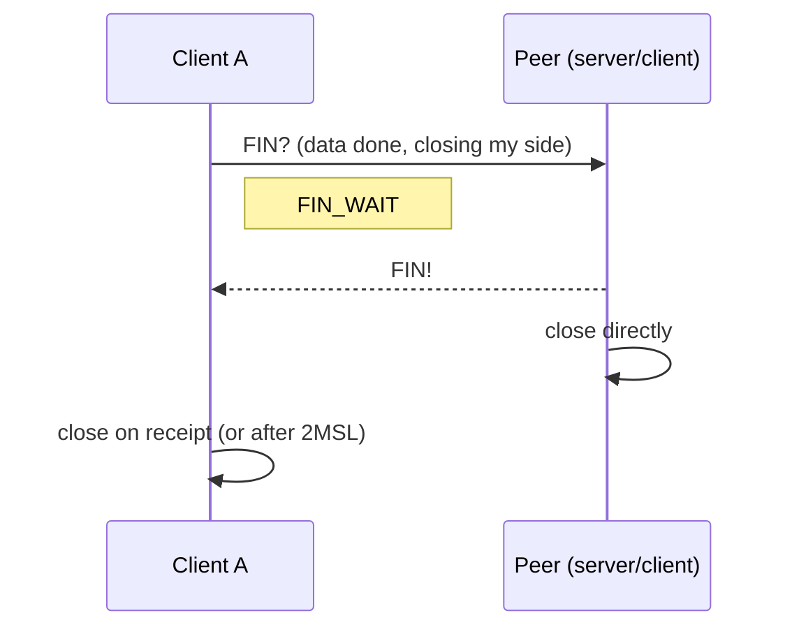
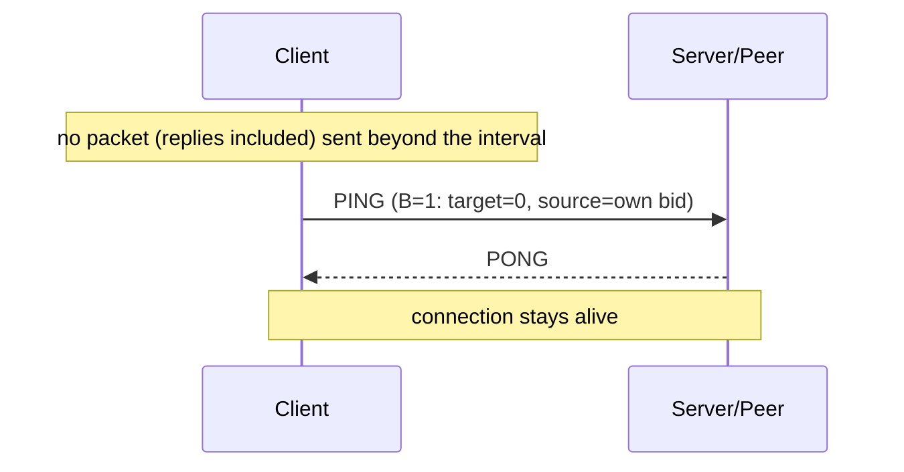

# Magpie Bridge Workflow Design

Two roles: **client** and **relay server**. Direct connection (B=0) is preferred when possible; otherwise packets go through the server (B=1). Servers are independent; clients pick one by connectivity speed.

> System commands (handshake/heartbeat/farewell) always use **D=0** and carry no dsn; replies pair by **socket** (reply to whichever socket the request came from). In the server scenario source bid validates identity only, never reply addressing. The sender needs no wait-for-reply queue.

## 1. Handshake (connection setup)

### 1.1 Client ↔ Server (apply for bid)

### 1.2 Client ↔ Client (B=0, direct)

> The server may attach the client socket info in SYN!, e.g. body `{"udp":"12.34.57.78:12345"}`.

## 2. Sending & Acknowledgement

- Data packet: A=0, D=1 (command optional or "DATA"), dsn incremented, with actual segment info;
- Any normal data packet is acknowledged with **COPY** (A=1, C=1, D=1, echoing source dsn/index/count); if B=1, swap target/source;
- The server sends no acknowledgement when relaying; the sender is confirmed by the receiver's COPY;
- System commands (D=0) reply with their own dedicated acknowledgements (SYN!/PONG/FIN!) instead of COPY.

## 3. Farewell (closing connection)

> Direct mode has two "directional pipes"; each pipe is closed by its initiator sending FIN. The peer, after passive close, actively closes the reverse pipe — overall similar to TCP's 4-way handshake.

## 4. Heartbeat (keep-alive)

> The server never initiates heartbeats; the connection state is maintained by the client.
