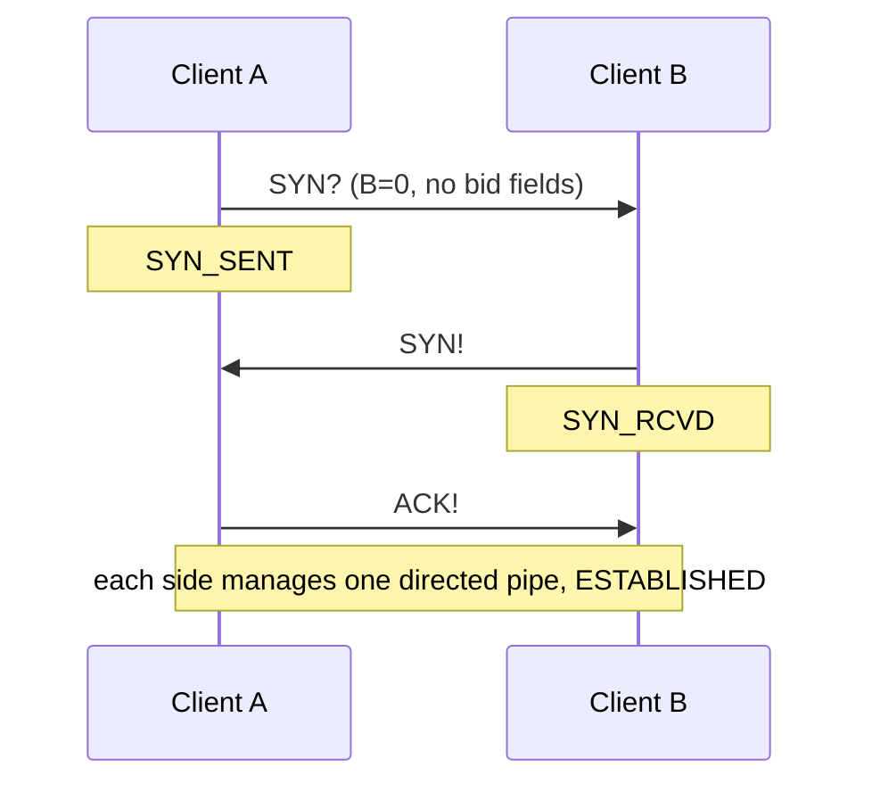
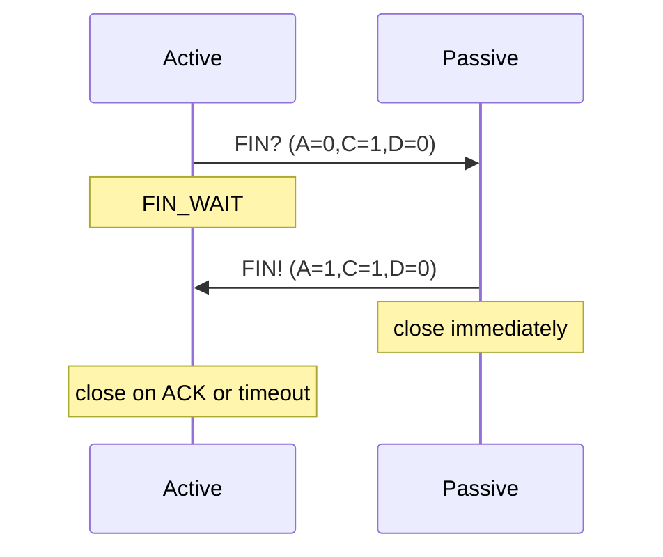
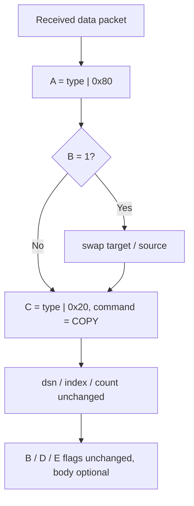

# Magpie Bridge Workflow Design

## Roles

- **Client**: registers a bid with a server, or connects directly to another client
- **Server S**: independent relay node, maintains yellow_pages (bid → socket), peers do not interconnect

Two paths: direct (B=0) or relayed via server (B=1).

## Handshake (3-way)

System commands are D=0; ACKs are paired by socket (reply to the socket it came from). No pending-ACK queue needed.

### Client → Server (B=1)

```mermaid
sequenceDiagram
    participant C as Client
    participant S as Server
    Note over C,S: C requests a bid; target/source are both 0
    C->>S: SYN? (A=0,C=1,D=0, target=0, source=0)
    Note over S: allocate random bid=x, bind socket
    S->>C: SYN! (A=1,C=1,D=0, target=x, source=0)
    Note over C: record bid=x
    C->>S: ACK! (A=1,C=1,D=0, target=0, source=x)
    Note over S: verify socket match, enter ESTABLISHED
```

### Client → Client (B=0)



## Teardown (2-way)

Unlike TCP's 4-way close, this closes immediately:



> In C-C mode the two directed pipes close independently; overall flow resembles TCP's 4-way close.

## Sending

### Relayed via Server (B=1)

1. A and B have both registered bids on S
2. A fills target=B_bid, source=A_bid and sends to S
3. S validates: target exists & active, source matches socket
4. S forwards the packet verbatim to B (no modification)

> The server does not ACK; B automatically replies COPY to confirm to A.

### Direct (B=0)

After handshake, send directly (no bid fields in header).

## ACK (COPY)

On receiving a data packet (A=0, D=1), reply with COPY (A=1, C=1, D=1):



System commands (D=0) do not get COPY; they get their dedicated ACK (SYN!/PONG/FIN!).

## Heartbeat

If a client sends nothing within a timeout, it sends PING; the peer replies PONG. The server never initiates heartbeats; the client keeps the connection alive.

- C-S: B=1, target=0, source=local bid
- C-C: B=0, the initiator maintains its own directed pipe
