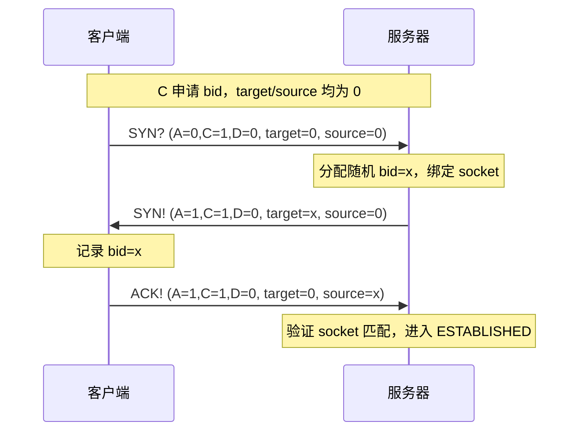
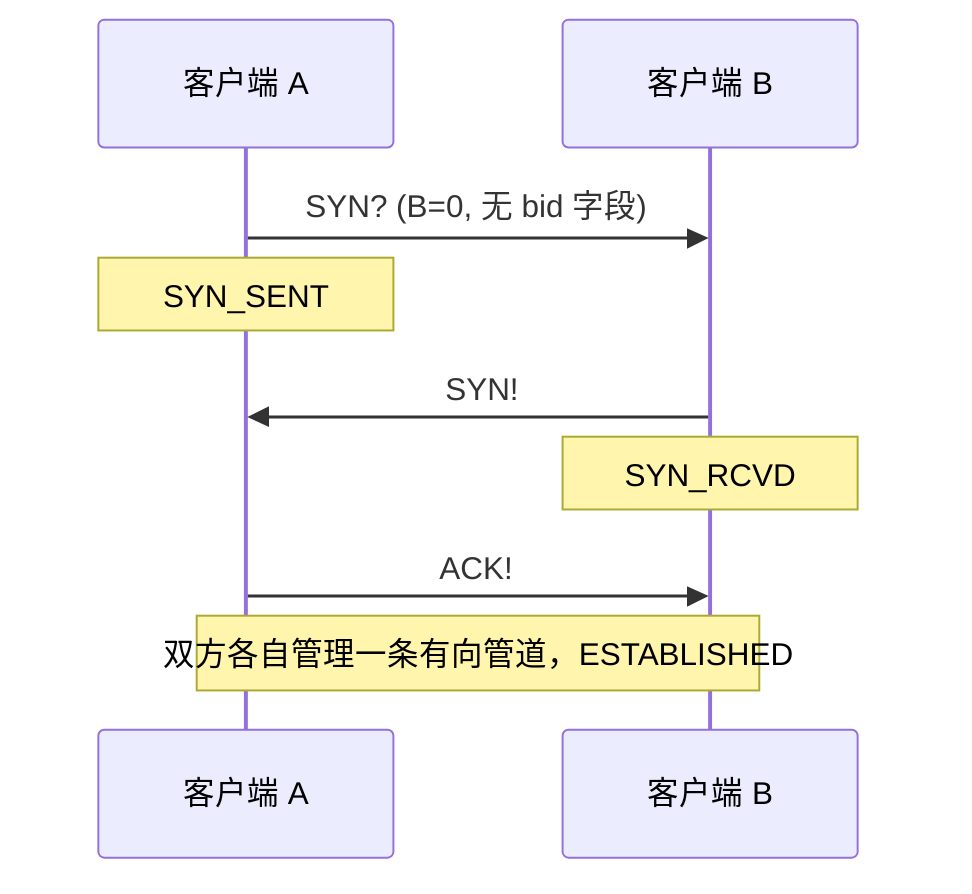
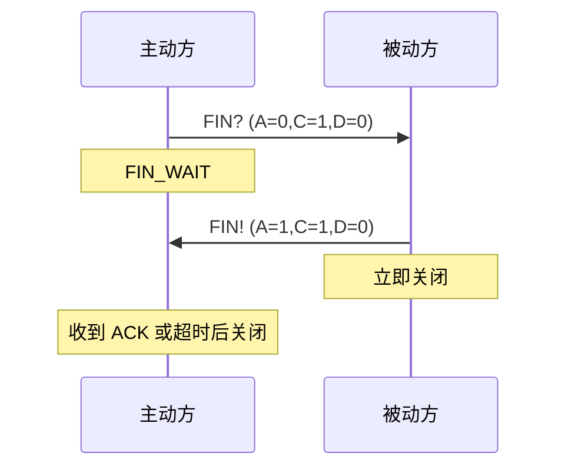
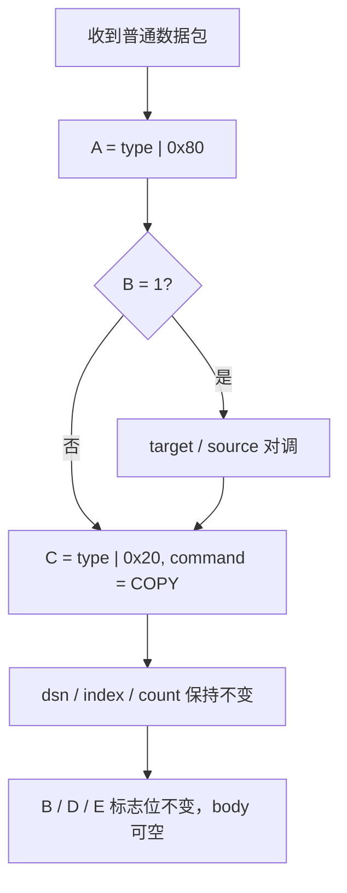

# Magpie Bridge 工作流设计

## 角色

- **客户端**：通过 bid 注册到服务器，或直连其他客户端
- **服务器 S**：独立转发节点，维护 yellow_pages（bid → socket），不与其他服务器关联

两种发送途径：直连（B=0）或经服务器转发（B=1）。

## 握手（3 次）

系统指令 D=0，应答配对依靠 socket（从哪来回哪去），无需维护等待队列。

### 客户端 → 服务器（B=1）

### 客户端 → 客户端（B=0）

## 挥手（2 次）

不同于 TCP 的 4 次挥手，这里直接关闭：

> C-C 场景下两条有向管道各自独立关闭，总流程类似 TCP 4 次挥手。

## 发送

### 经服务器转发（B=1）

1. A、B 均已在 S 注册 bid
2. A 填写 target=B_bid, source=A_bid，发往 S
3. S 校验：target 存在且活跃、source 与 socket 匹配
4. S 原样转发给 B（不修改包）

> 服务器不回复应答，由 B 自动回 COPY 给 A 确认。

### 直连（B=0）

双方握手建立连接后，直接发送（包头无 bid 字段）。

## 应答（COPY）

收到普通数据包（A=0, D=1）时回复 COPY（A=1, C=1, D=1）：

系统指令（D=0）不回 COPY，回各自专用应答（SYN!/PONG/FIN!）。

## 心跳

客户端超时未发包则主动发 PING，对端回 PONG。服务器不主动发起，连接保活由客户端负责。

- C-S：B=1，target=0, source=本机 bid
- C-C：B=0，发起方维护自己方向的管道
