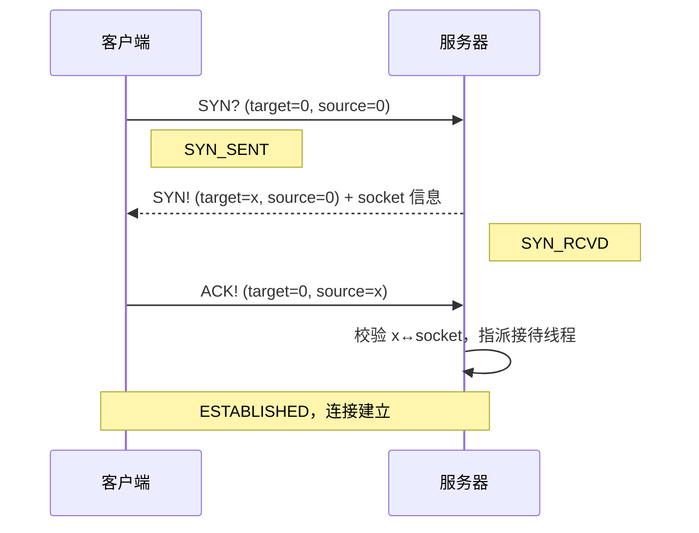
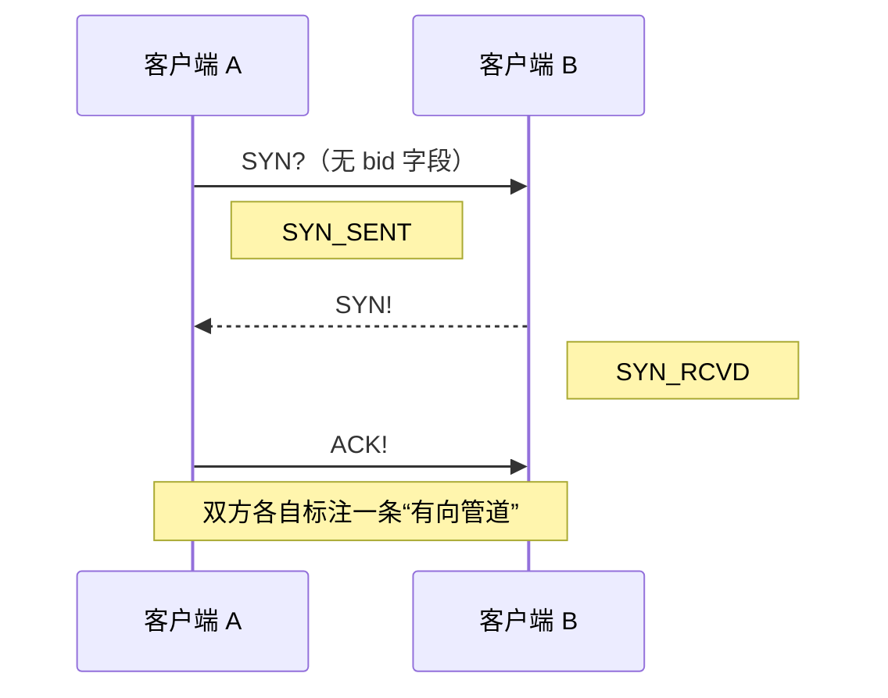
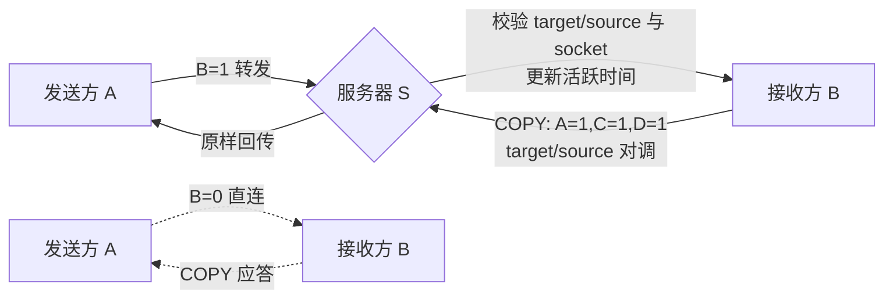
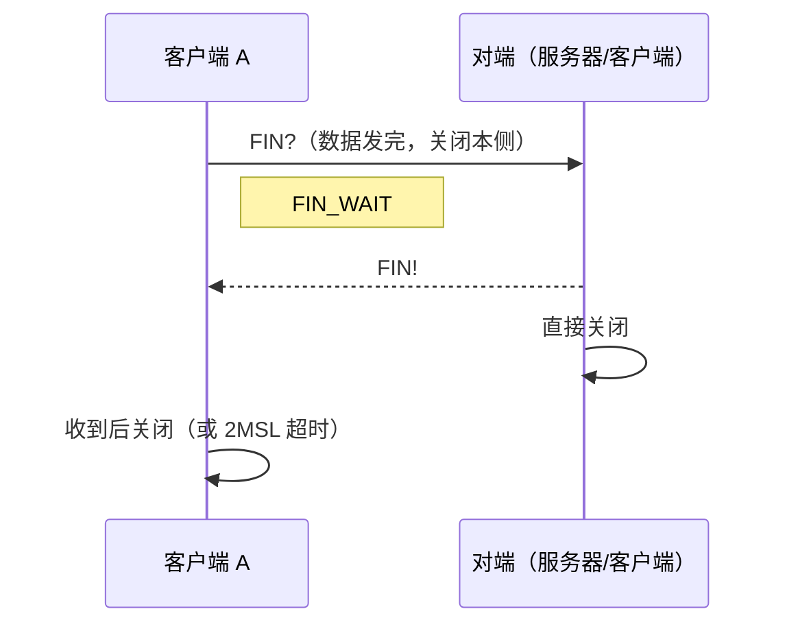
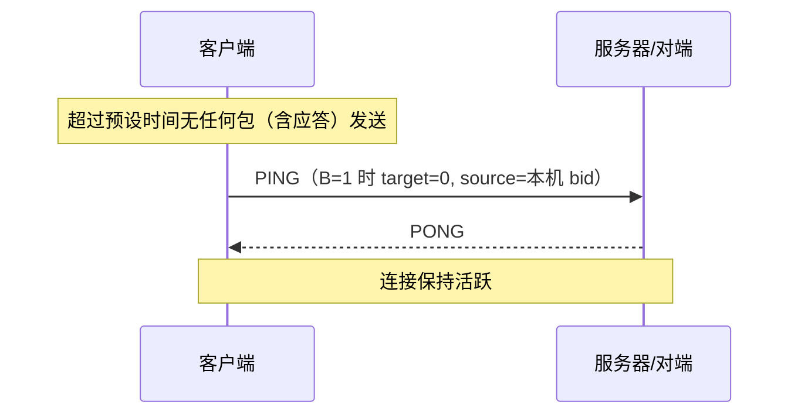

# Magpie Bridge 工作流设计

角色分**客户端**和**转发服务器**两种：可直连优先直连（B=0），否则经服务器转发（B=1）。服务器彼此独立，客户端按连通速度自选。

> 系统指令（握手/挥手/心跳）一律 **D=0**，不携带 dsn；应答按 **socket 配对**（从哪个 socket 收到就回哪个）。服务器场景下 source bid 仅作身份校验，不参与应答寻址。发送方无需维护等待应答队列。

## 1. 握手机制（建立连接）

### 1.1 客户端 ↔ 服务器（申请 bid）

### 1.2 客户端 ↔ 客户端（B=0，直连）

> 服务器回复 SYN! 时可附带客户端 socket 信息（如包体 `{"udp":"12.34.57.78:12345"}`）。

## 2. 发送与应答机制

- 数据包：A=0, D=1（command 可无或 "DATA"），dsn 自增，携带实际分片信息；
- 收到普通数据包即回 **COPY**（A=1, C=1, D=1，回填源 dsn/index/count）；B=1 时 target/source 对调；
- 服务器转发不回应答，发送方凭接收方 COPY 确认收到；
- 系统指令（D=0）不回复 COPY，回各自专用应答（SYN!/PONG/FIN!）。

## 3. 挥手机制（关闭连接）

> 直连场景为两条"有向管道"，各管道由发起方主动 FIN 关闭；对端被动关闭后主动发起反方向关闭，总体接近 TCP 四次挥手。

## 4. 心跳机制（保活）

> 服务器不主动发起心跳，连接状态由客户端维护。
