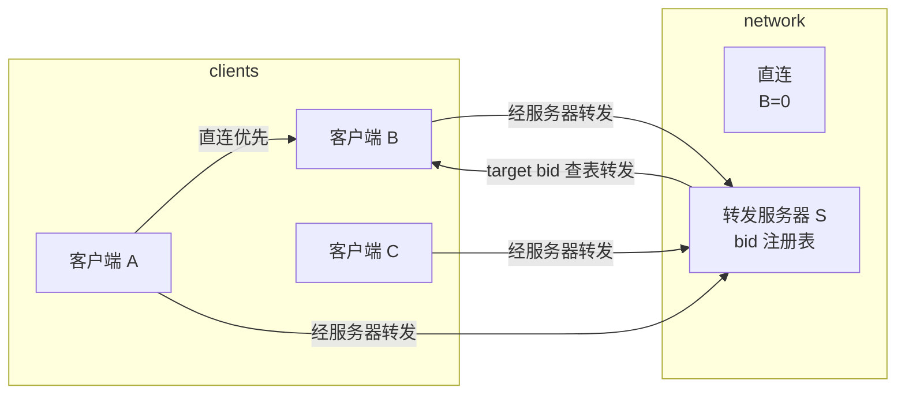
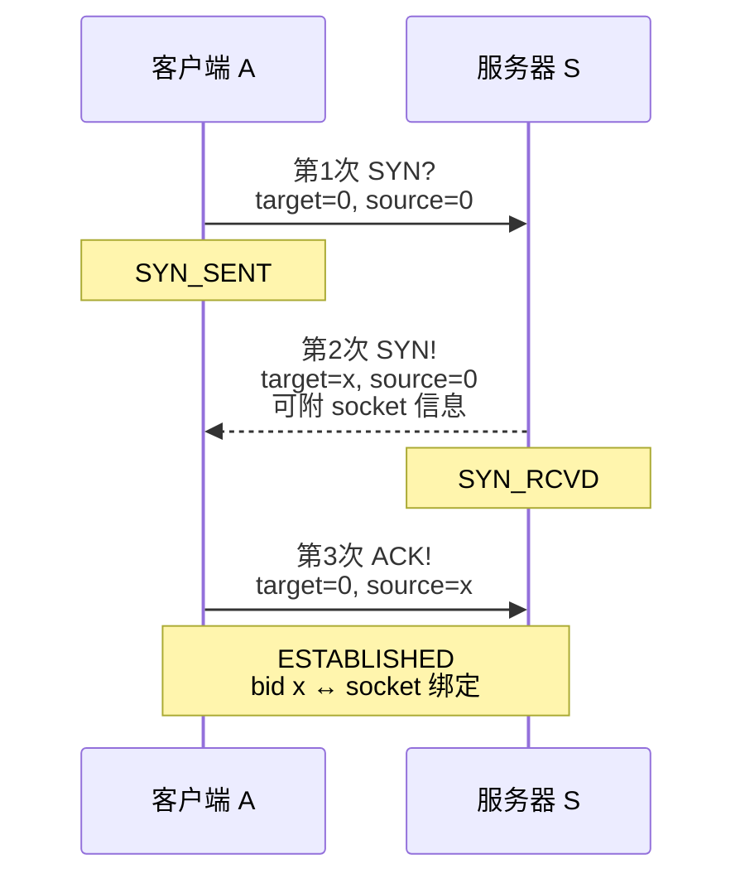
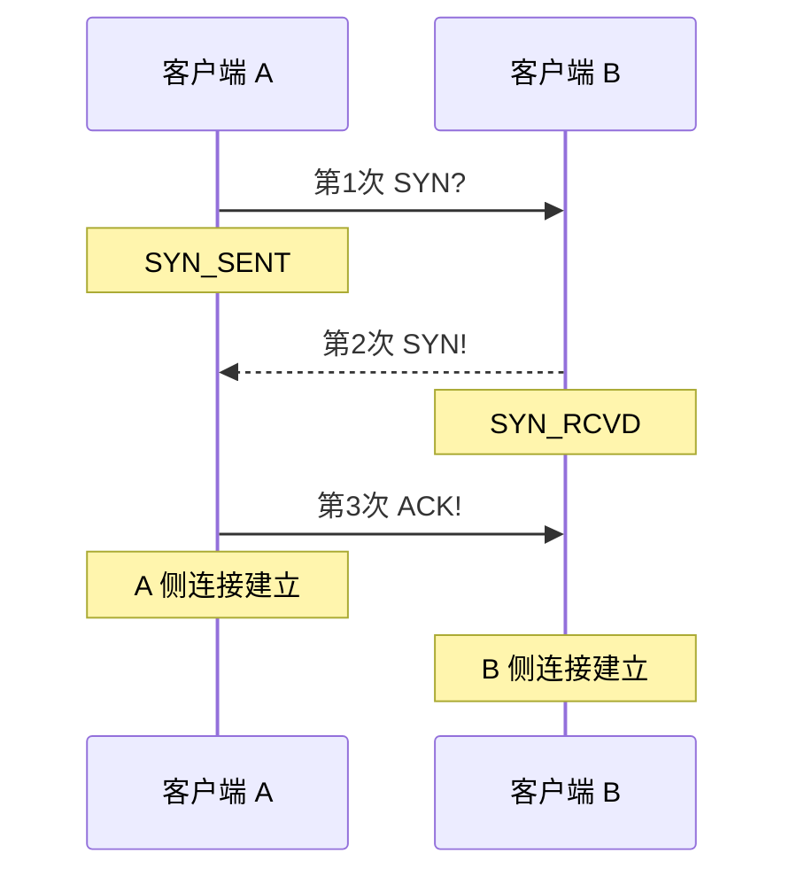
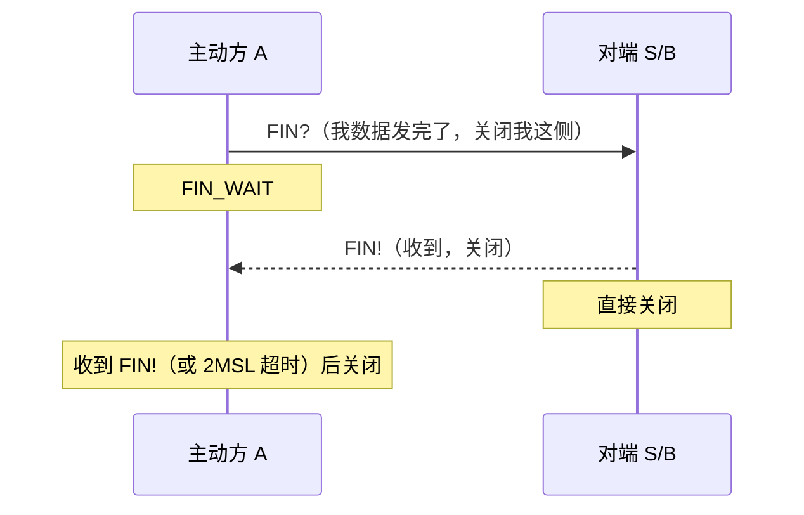
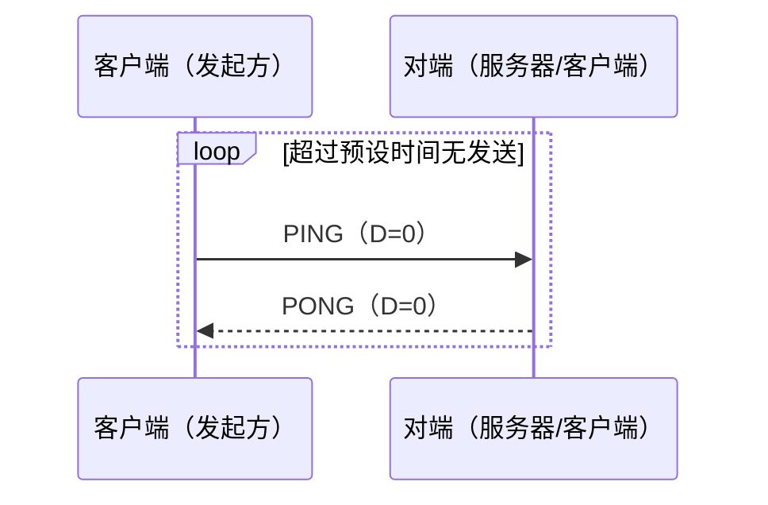
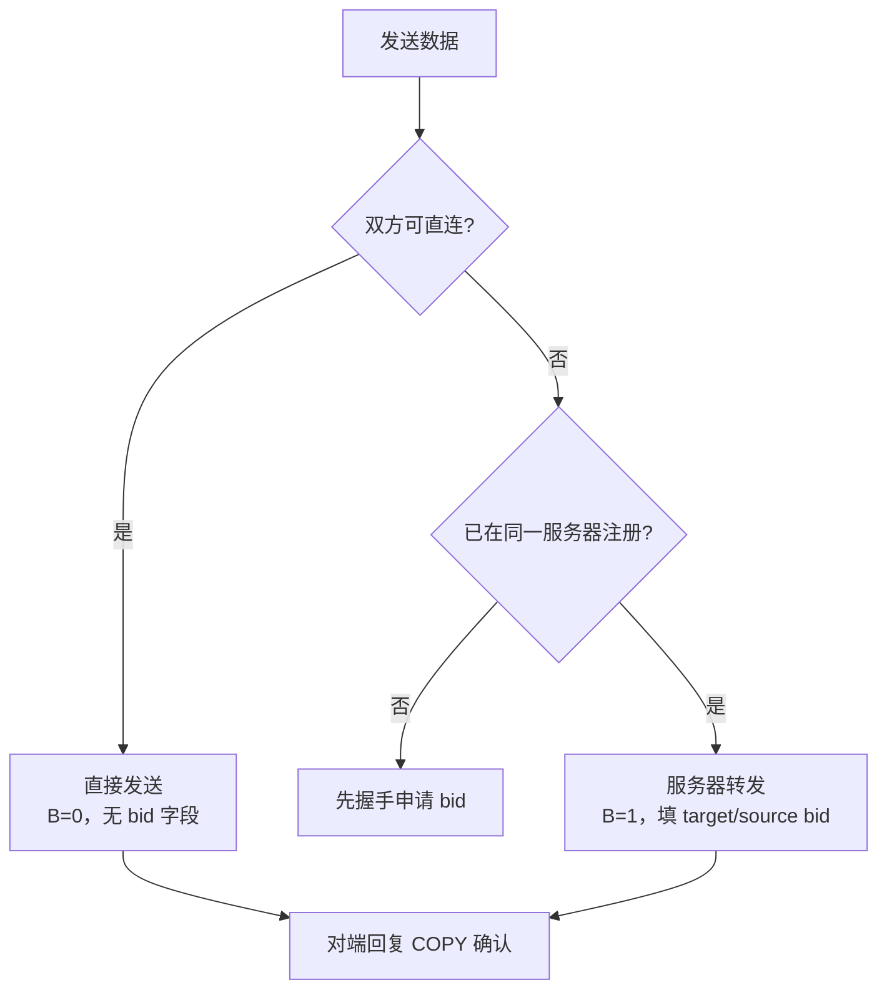
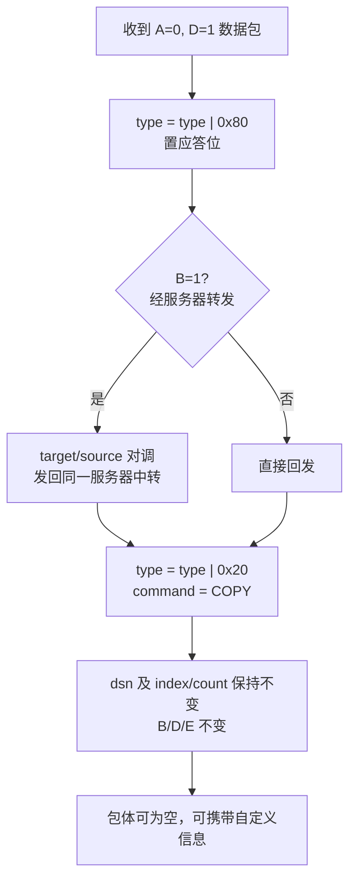

# Magpie Bridge 工作流设计

角色分**客户端**与**转发服务器**。两客户端能直连则优先直连，否则经服务器 S 转发。转发服务器彼此独立，客户端按连通速度自行选择。

## 1. 网络拓扑

## 2. 握手机制（建立连接）

客户端需先向服务器申请 bid（门牌号），此后其他客户端才能凭 bid 请求转发。客户端直连则无需 bid，但仍需握手。

| 步骤 | Flags | Command | DSN |
|---|---|---|---|
| 第 1 次 | A=0, C=1, D=0, E=0 | SYN? | - |
| 第 2 次 | A=1, C=1, D=0, E=0 | SYN! | - |
| 第 3 次 | A=1, C=1, D=0, E=0 | ACK! | - |

> 系统指令不携带 dsn（D=0），应答配对依靠 socket：从哪个 socket 收到请求，就向哪个 socket 回复；服务器场景下 source bid 仅用于身份校验（验证 bid 与 socket 的绑定），不参与应答寻址。发送方无需维护等待应答的队列。

### 2.1 客户端 ↔ 服务器（B=1）

> x 为服务器按 socket 申请的随机整数。服务器回复 SYN! 时可附带客户端 socket 信息（如包体 `{"udp":"12.34.57.78:12345"}`，`body_size = len(body)`）。

### 2.2 客户端 ↔ 客户端（B=0）

> C-C 握手相当于双方各管理一条单向"有向管道"：A 发出 ACK 后即本地标注连接已建立；B 收到该 ACK 后也标注连接已建立。

### 2.3 bid 语义

- 服务器即"桥"，bid 是客户端首次连接时分配的一个整数（门牌号）；
- 申请到 bid 后需通过其他途径广播出去；发送方在 target bid 填对方号码，服务器查注册表找到对应 socket 转发；
- **target bid = 0**：发给服务器自身（一般用于握手/挥手）；
- **source bid = 0**：只可能是服务器下发的包。若 source=0 而 target≠0，判为非法数据丢弃；
- 服务器收到 target/source 均非 0 的包才认为需要转发：分别校验两个 bid（source 须与 socket 匹配，不匹配即丢弃），正确则**原样转发**到 target 对应 socket；
- B 经服务器给 A 发包时，B 必须填入自己的 source bid，否则 A 无法识别发送方、无法回自动应答。

## 3. 挥手机制（关闭连接）

连接虽有超时判活，仍可主动挥手直接关闭。

| 步骤 | Flags | Command | DSN |
|---|---|---|---|
| 第 1 次 | A=0, C=1, D=0, E=0 | FIN? | - |
| 第 2 次 | A=1, C=1, D=0, E=0 | FIN! | - |

> 与 TCP 4 次挥手不同，这里是直接关闭。C-C 场景存在两条有向管道：收到 FIN 并被动关闭的管道，随后会主动发起反方向管道的关闭流程，总体上接近 TCP 4 次挥手。

## 4. 心跳机制（保活）

客户端定期检查自身发送时间，超过预设时间无任何数据包发送（含应答），则主动发心跳维持连接。

> 心跳发给服务器时 B=1（target=0, source=本机 bid）；直连时 B=0。服务器无需主动发起心跳；C-S 连接状态由客户端维护，C-C 的每条有向管道由各自发起方维护。

## 5. 发送机制

| 途径 | Flags | Command | DSN | index, count |
|---|---|---|---|---|
| 服务器转发 | A=0, B=1, C=0/1, D=1 | 可选 DATA | 自增值 | 实际分片信息 |
| 直接发送 | A=0, B=0, C=0/1, D=1 | 可选 DATA | 自增值 | 实际分片信息 |

- 服务器转发时**无需向发送方回复应答**，发送方凭接收方自动回复的 COPY 确认收到；
- 服务器检查 target bid 存在且活跃（规定时间 T 内有上行），并校验 source bid 与 socket 匹配，通过后更新活跃时间并原样转发。

## 6. 应答机制

收到普通数据包（A=0, D=1，command 为 DATA 或无 command）时，均须回复数据应答包 COPY（A=1, D=1，回填源 dsn 及 index/count）。系统指令（D=0）不回复 COPY，而回各自专用应答（SYN!/PONG/FIN!）。

| 途径 | Flags | Command | DSN | index, count |
|---|---|---|---|---|
| 服务器转发 | A=1, B=1, C=1, D=1 | COPY | 源值 | 源分片信息 |
| 直接发送 | A=1, B=0, C=1, D=1 | COPY | 源值 | 源分片信息 |

> 参数规则：A=1（`type = type | 0x80`）；B=1 时 target/source 对调；C=1 且 command=COPY；dsn/index/count 不变；B/D/E 不变；包体可为空。
